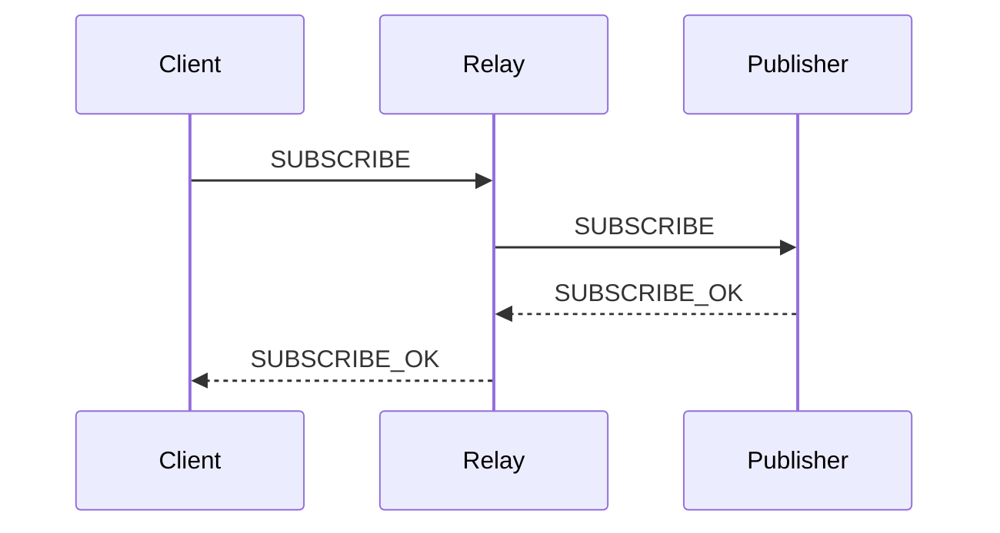

# Create Pull Request

## Steps

1. Review the change: `git status`, `git diff origin/master...HEAD`, and `git log origin/master..HEAD --oneline`.
2. Commit any uncommitted work. Commit messages are English and follow the Conventional Commits rules in `AGENTS.md`.
3. Push the branch: `git push -u origin <branch>`.
4. Draft the title and body, then have a subagent review them for redundancy (see *Review Before Posting*) and apply its cuts.
5. Create the PR with `gh pr create --base master --title <title> --body <body>`.
   - If a PR already exists for the branch, push the new commits and update the existing PR with `gh pr edit` instead of creating a duplicate.
6. Report the PR URL.

## Title

- Write in Japanese.
- Prefix with the Conventional Commits type and scope, matching the commits: `feat(relay): ...`.
- State what changed, not how it was implemented.

## Body

Use `.github/pull_request_template.md` as-is. Keep every heading, replace each HTML comment with the actual content, and delete no section — write `なし` when a section does not apply.

Keep every section to one line where possible, and never more than three lines. Bullets count as lines: group related changes into a single bullet rather than listing every file. A section that will not fit in three lines usually means the PR is too large, or that the detail belongs in the diff rather than the description.

Section rules:

- `## 概要` — exactly 3 lines. One line each for background, what was done, and the result. This is the only part some reviewers read.
- `## 関連タスク` — link issues as `#<IssueNumber>`. This repository is public OSS, so never paste internal tracker URLs.
- `## やらないこと` — state what was deliberately left out, so reviewers do not look for it.
- `## 影響範囲` — name the affected crates and whether the change is breaking for dependents. `moqt` is the central crate, so changes there affect the whole workspace.
- `## テスト` — the commands actually run and their results. If a check was skipped, say so.

Write the whole body in Japanese.

## Review Before Posting

Never post the first draft. Pass the drafted title and body to a subagent and ask it to cut anything that costs the reader attention without informing the review:

- Sentences that restate the diff, the section heading, or a point already made elsewhere in the body
- Background the reviewer of this repository already knows
- Hedging and filler that carries no information

Ask for the shortened text plus a one-line reason per cut, then apply the cuts you agree with. Do not let the review add new content — it only removes. Verify the result still satisfies the line limits and keeps every template section.

## Mermaid Diagrams

Add a mermaid diagram only when prose alone is hard to follow — a changed message flow between client, relay, and server, a state transition, or a new module dependency. Place it under `## やったこと`.

Skip the diagram for changes that are already clear in text, such as documentation edits, dependency bumps, or single-function fixes. A diagram that just restates the file list is noise.

