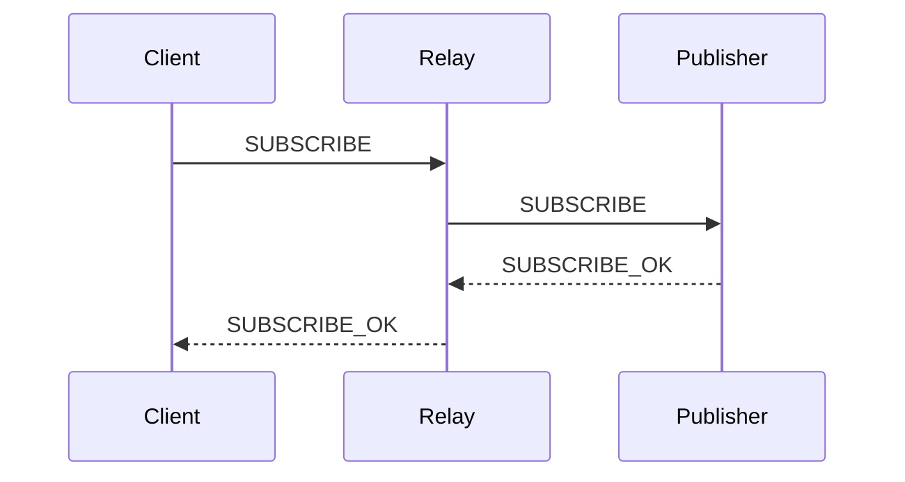

# Create Pull Request

## Steps

1. Review the change: `git status`, `git diff origin/master...HEAD`, and `git log origin/master..HEAD --oneline`.
2. Run the ponytail review on the diff and apply its cuts (see *Ponytail Review*). Repeat until it answers `Lean already. Ship.`
3. Commit any uncommitted work. Commit messages are English and follow the Conventional Commits rules in `AGENTS.md`.
4. Push the branch: `git push -u origin <branch>`.
5. Draft the title and body, then have a subagent review them (see *Review Before Posting*) and apply its edits.
6. Create the PR with `gh pr create --base master --title <title> --body <body>`.
   - If a PR already exists for the branch, push the new commits and update the existing PR with `gh pr edit` instead of creating a duplicate.
7. Report the PR URL.

## Plugins

Two steps run skills from third-party plugins rather than rules written here:

| Plugin | Skill |
| --- | --- |
| [ponytail](https://github.com/DietrichGebert/ponytail) | `ponytail-review` |
| [i-have-adhd](https://github.com/ayghri/i-have-adhd) | `i-have-adhd` |

`.claude/settings.json` declares both, so Claude Code offers to install them when the repository is opened. It also sets `PONYTAIL_DEFAULT_MODE=off`, which keeps ponytail's always-on mode out of sessions here; only its skills load. If a skill is missing, stop and ask the user to install the plugin; do not improvise the review.

## Ponytail Review

Invoke the `ponytail-review` skill on `git diff origin/master...HEAD`. It lists cuts and does not apply them. Run it every time a PR is requested, including via the desktop "Create PR" command and when the user has waived QA.

Apply every cut except those that remove something the user asked for by name (an API, an option, a test). A finding that exposes a bug, such as duplicated logic that has diverged, is fixed in its own `fix` commit rather than folded into the cut.

## Title

- Write in Japanese.
- Prefix with the Conventional Commits type and scope, matching the commits: `feat(relay): ...`.
- State what changed, not how it was implemented.

## Body

Start from `.github/pull_request_template.md` and replace each HTML comment with the actual content. Keep the order and wording of the headings you keep.

Delete a section outright when it would only hold `なし`, or when its content restates another section. An empty heading makes the reader stop for nothing, so an omitted section is better than a filled-in one that says nothing. `## 概要` and `## やったこと` are always present.

Keep every section to one line where possible, and never more than three lines. Bullets count as lines: group related changes into a single bullet rather than listing every file. A section that will not fit in three lines usually means the PR is too large, or that the detail belongs in the diff rather than the description.

Section rules:

- `## 概要` — at most 3 lines: why the change was needed, what was done, and anything the reviewer must know before reading the diff. Stop at two lines when there is no third fact. Never pad to three.
- `## 関連タスク` — link issues as `#<IssueNumber>`. This repository is public OSS, so never paste internal tracker URLs.
- `## やらないこと` — state what was deliberately left out, so reviewers do not look for it.
- `## 影響範囲` — name the affected crates and whether the change is breaking for dependents. `moqt` is the central crate, so changes there affect the whole workspace.
- `## テスト` — the commands actually run and their results. If a check was skipped, say so.

### Do Not Write

Cut any sentence whose truth follows automatically from the change itself. It reads as a conclusion but carries no information the reviewer did not already have.

- The expected benefit or significance of the change: 「〜できるようになります」「〜が改善されます」「〜の負担が減ります」
- General statements about why the practice is good: 「規約が統一されていると保守しやすくなります」
- Effects that were not measured. Write a number and the condition, or write nothing.

Concrete example. In a PR that adds conventions to `AGENTS.md`, this third line was cut:

> エージェントと人間が、同じ規約を読み込んだ状態で作業を始められます。

It only restates what "adding conventions" means, so the summary became two lines instead of three.

Write the whole body in Japanese.

## Review Before Posting

Never post the first draft. Pass the drafted title and body to a subagent with the two checks below. Ask for the revised text plus a one-line reason per edit, then apply the edits you agree with. The review may cut, reorder, and renumber; it must not add facts. Verify the result still satisfies the line limits.

### Redundancy

Cut anything that costs the reader attention without informing the review:

- Sentences that restate the diff, the section heading, or a point already made elsewhere in the body
- Background the reviewer of this repository already knows
- Hedging and filler that carries no information
- Claims of effect or benefit that follow automatically from the change (see *Do Not Write*)

Whole sections are in scope: the review may propose deleting one, not just shortening it.

### i-have-adhd

`i-have-adhd` sets `disable-model-invocation: true`, so the Skill tool cannot load it. Have the subagent read the skill file from the installed plugin instead: take `installPath` of `i-have-adhd@i-have-adhd` from `~/.claude/plugins/installed_plugins.json` and open `skills/i-have-adhd/SKILL.md` under it.

Apply its rules to the body as if it were a single response to the reviewer. Rules about turn-to-turn state, time estimates, and closers have no PR equivalent; skip them.

## Mermaid Diagrams

Add a mermaid diagram only when prose alone is hard to follow — a changed message flow between client, relay, and server, a state transition, or a new module dependency. Place it under `## やったこと`.

Skip the diagram for changes that are already clear in text, such as documentation edits, dependency bumps, or single-function fixes. A diagram that just restates the file list is noise.

```mermaid
sequenceDiagram
    Client->>Relay: SUBSCRIBE
    Relay->>Publisher: SUBSCRIBE
    Publisher-->>Relay: SUBSCRIBE_OK
    Relay-->>Client: SUBSCRIBE_OK
```
