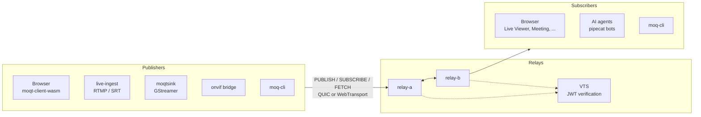

# moq-wasm

## What is moq-wasm?

Real-time communication of any data for web browsers, native apps, IP
cameras, USB cameras, robots, drones and AI agents. One publish/subscribe API
with a simple architecture, high-performance QUIC transport, priority control
and caching, so you no longer have to pick between WebSocket, MQTT, HLS, DASH
and WebRTC for each use case.

Implements Media over QUIC Transport
[draft-ietf-moq-transport-14](https://datatracker.ietf.org/doc/draft-ietf-moq-transport/14/)
in Rust (drafts in [`docs/spec/`](docs/spec/)).

## Use cases and demos

Try the demos hosted at **<https://nttcom.github.io/moq-wasm/>**. They
connect to the cloud relay by default, so nothing needs to be installed.

| Use case | Demo |
| --- | --- |
| Video meetings | [Meeting](https://nttcom.github.io/moq-wasm/examples/meeting/) |
| Large-scale live streaming | [Live Viewer](https://nttcom.github.io/moq-wasm/examples/live-viewer/): live playback with rewind and rendition switching |
| Video on demand | [Live Viewer](https://nttcom.github.io/moq-wasm/examples/live-viewer/): publish an MP4 from the browser |
| Remote monitoring and control of IP cameras | [ONVIF](https://nttcom.github.io/moq-wasm/examples/onvif/): PTZ control and monitoring |
| Remote monitoring from USB cameras | [Remote Monitoring](https://nttcom.github.io/moq-wasm/examples/remote-monitoring/) |
| Real-time chat moderation by an AI agent | [MoQ Chat Moderation](https://nttcom.github.io/moq-wasm/examples/moq-chat-moderation/) |
| Real-time video analysis by an AI agent | [MoQ Camera Detection](https://nttcom.github.io/moq-wasm/examples/moq-camera-detection/): answers questions about a camera feed |
| Remote monitoring, data collection and control of drones | |
| Remote monitoring, data collection and control of robots | |
| Remote monitoring, data collection and control of autonomous vehicles | |

Publishers outside the browser: [`crates/moqt-bridge-live-ingest`](crates/moqt-bridge-live-ingest/README.md) (RTMP/SRT),
[`crates/gst-plugin-moqt`](crates/gst-plugin-moqt/README.md) (`moqtsink`),
[`examples/rust/moq-cli`](examples/rust/moq-cli/README.md) and the
[pipecat bots](examples/python). Details of every browser demo are in
[`examples/browser/README.md`](examples/browser/README.md).

## Getting Started

```shell
nix develop
npm --prefix examples/browser ci
```

### Single relay

Run a relay, publish a test stream and watch it, in four terminals:

```shell
make relay          # 1. relay and a local VTS on https://127.0.0.1:4433
make live-ingest    # 2. RTMP/SRT ingest publishing to the relay
make ffmpeg-srt     # 3. test pattern over SRT into the ingest
make browser        # 4. wasm build and the example hub on http://localhost:5173
```

Then `make chrome` (`make chrome:linux` on Linux) opens Chrome trusting the
relay's self-signed certificate. Open Live Viewer from the hub and watch
`anon/live/test`.

### Two relays

```shell
docker compose up -d
```

Starts `relay-a` (`https://127.0.0.1:4433`) and `relay-b` (`:4434`) sharing a
VTS and a Redis route registry, the topology the cascading, auth and meeting
E2E use. The `make` targets above publish to `relay-a` and resolve the Docker
Desktop bridge host for native clients on macOS.

### Tests

```shell
make test                        # Rust unit tests
make browser-e2e-media           # browser publish/subscribe
./tests/auth-e2e/run.sh            # relay scenarios, see tests/README.md
cargo test -p vts                # VTS
```

## Architecture



Every client speaks MoQT to a relay over QUIC or WebTransport. Relays cache
objects for FETCH, forward subscriptions to each other and authenticate
sessions through the VTS. The `moqt` crate is the protocol library every other
component builds on. Every Rust crate lives in `crates/<package name>/`.

| Path | Component |
| --- | --- |
| [`crates/moqt/`](crates/moqt/README.md) | Protocol library: wire format, sessions, publisher and subscriber API |
| [`crates/relay/`](crates/relay/README.md) | Relay: QUIC and WebTransport on one port, cache, FETCH, cascading, JWT auth |
| [`crates/moqt-client-wasm/`](crates/moqt-client-wasm/README.md) | WebAssembly bindings used by the browser examples |
| [`crates/gst-plugin-moqt/`](crates/gst-plugin-moqt/README.md) | GStreamer plugin with the `moqtsink` element |
| [`crates/moqt-bridge-live-ingest/`](crates/moqt-bridge-live-ingest/README.md) | RTMP and SRT ingest into MoQT |
| [`crates/moqt-bridge-onvif/`](crates/moqt-bridge-onvif/README.md) | ONVIF/RTSP cameras with PTZ control into MoQT |
| [`crates/mediapack/`](crates/mediapack/README.md), [`msf/`](crates/msf/README.md), [`publisher/`](crates/publisher/README.md), [`transcode/`](crates/transcode/README.md) | Media crates shared by the publishers: containers, MSF catalog, track publishing, re-encoding |
| [`crates/vts/`](crates/vts/README.md), [`auth-token/`](crates/auth-token/README.md) | Verify Token Service: checks client JWTs for the relay; the shared JWT claims type |
| [`examples/`](examples/browser/README.md) | Browser examples, `moq-cli`, pipecat bots |
| [`tests/`](tests/README.md) | Relay E2E scenarios: auth, FETCH, cache eviction, cascading, dedup |
| [`docs/architecture/`](docs/architecture) | Architecture and dependency decisions per crate |

Architecture documents:
[`moqt`](docs/architecture/moqt/architecture.md),
[`relay`](docs/architecture/relay/architecture.md),
[`publisher`](docs/architecture/publisher/architecture.md),
[Live Player](docs/architecture/browser-examples/live-player.md).
Contributor rules: [`AGENTS.md`](AGENTS.md).

## Authentication

Relays always authenticate. A session without a token is limited to
`anon/**`, which every demo uses by default. Tokens are HS256 JWTs verified
by the VTS; mint one with `vts-mint`. See
[`crates/vts/README.md`](crates/vts/README.md).
