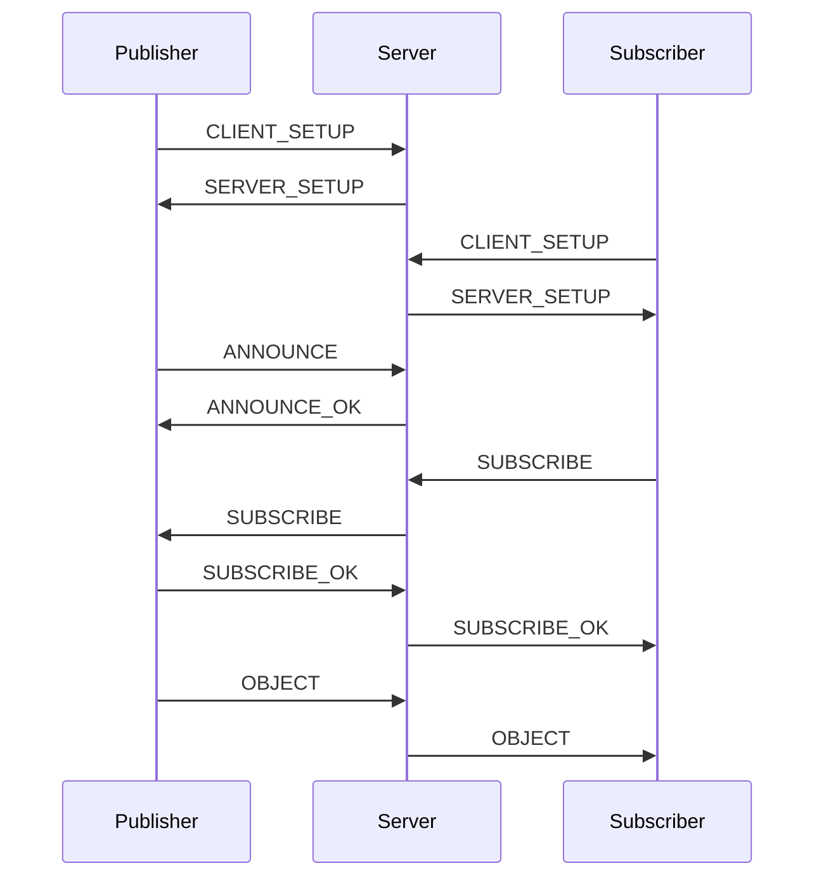

# シーケンス図

```mermaid
sequenceDiagram
    participant Publisher
    participant Server
    participant Subscriber

    Publisher ->> Server: CLIENT_SETUP
    Server ->> Publisher: SERVER_SETUP
    Subscriber ->> Server: CLIENT_SETUP
    Server ->> Subscriber: SERVER_SETUP

    Publisher ->> Server: ANNOUNCE
    Server ->> Publisher: ANNOUNCE_OK

    Subscriber ->> Server: SUBSCRIBE
    Server ->> Publisher: SUBSCRIBE
    Publisher ->> Server: SUBSCRIBE_OK
    Server ->> Subscriber: SUBSCRIBE_OK

    Publisher ->> Server: OBJECT
    Server ->> Subscriber: OBJECT

```
