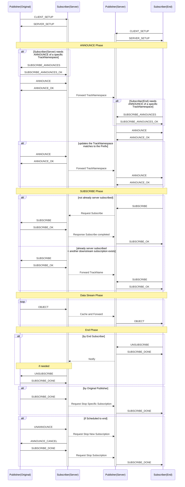

# SEQUENCE

```mermaid
sequenceDiagram
    participant Publisher(Original)
    participant Subscriber(Server)
    participant Publisher(Server)
    participant Subscriber(End)

    Publisher(Original) ->> Subscriber(Server): CLIENT_SETUP
    activate Subscriber(Server)
    Subscriber(Server) ->> Publisher(Original): SERVER_SETUP
    Subscriber(End) ->> Publisher(Server): CLIENT_SETUP
    activate Publisher(Server)
    Publisher(Server) ->> Subscriber(End): SERVER_SETUP

    Note over Publisher(Original), Subscriber(End) : ANNOUNCE Phase

    alt Subscriber(Server) needs ANNOUNCE of a specific TrackNamespace
        Subscriber(Server) ->> Publisher(Original): SUBSCRIBE_ANNOUNCES
        Publisher(Original) ->> Subscriber(Server): SUBSCRIBE_ANNOUNCES_OK
    end

    Publisher(Original) ->> Subscriber(Server): ANNOUNCE
    Subscriber(Server) ->> Publisher(Original): ANNOUNCE_OK
    Subscriber(Server) -->> Publisher(Server): Forward TrackNamespace


    alt Subscriber(End) needs ANNOUNCE of a specific TrackNamespace
        Subscriber(End) ->> Publisher(Server): SUBSCRIBE_ANNOUNCES
        Publisher(Server) ->> Subscriber(End): SUBSCRIBE_ANNOUNCES_OK
    end

    Publisher(Server) ->> Subscriber(End): ANNOUNCE
    Subscriber(End) ->> Publisher(Server): ANNOUNCE_OK

    alt updates the TrackNamespace matches to the Prefix
        Publisher(Original) ->> Subscriber(Server): ANNOUNCE
        Subscriber(Server) ->> Publisher(Original): ANNOUNCE_OK
        Subscriber(Server) -->> Publisher(Server): Forward TrackNamespace
        Publisher(Server) ->> Subscriber(End): ANNOUNCE
        Subscriber(End) ->> Publisher(Server): ANNOUNCE_OK
    end


    Note over Publisher(Original), Subscriber(End) : SUBSCRIBE Phase
    alt not already server subscribed
Subscriber(End) ->> Publisher(Server): SUBSCRIBE
        Publisher(Server) -->> Subscriber(Server): Request Subscribe
        Subscriber(Server) ->> Publisher(Original): SUBSCRIBE
        Publisher(Original) ->> Subscriber(Server): SUBSCRIBE_OK
        Subscriber(Server) -->> Publisher(Server): Response Subscribe completed
        Publisher(Server) ->> Subscriber(End): SUBSCRIBE_OK
    else already server subscribed <br> = another downstream subscription exists
        Subscriber(Server) ->> Publisher(Original): SUBSCRIBE
        Publisher(Original) ->> Subscriber(Server): SUBSCRIBE_OK
        Subscriber(Server) -->> Publisher(Server): Forward TrackName
        Subscriber(End) ->> Publisher(Server): SUBSCRIBE
        Publisher(Server) ->> Subscriber(End): SUBSCRIBE_OK
    end

    Note over Publisher(Original), Subscriber(End) : Data Stream Phase

    loop
        Publisher(Original) ->> Subscriber(Server): OBJECT
        Subscriber(Server) -->> Publisher(Server): Cache and Forward
        Publisher(Server) ->> Subscriber(End): OBJECT
    end

    Note over Publisher(Original), Subscriber(End) : End Phase

   alt by End Subscriber
        Subscriber(End) ->> Publisher(Server): UNSUBSCRIBE
        Publisher(Server) ->> Subscriber(End): SUBSCRIBE_DONE
        Publisher(Server) -->> Subscriber(Server): Notify
        Note over Subscriber(Server), Publisher(Original): if needed
        Subscriber(Server) ->> Publisher(Original): UNSUBSCRIBE
        Publisher(Original) ->> Subscriber(Server): SUBSCRIBE_DONE
  end
  alt by Original Publisher
        Publisher(Original) ->> Subscriber(Server): SUBSCRIBE_DONE
        Subscriber(Server) -->> Publisher(Server): Request Stop Specific Subscription
        Publisher(Server) ->> Subscriber(End): SUBSCRIBE_DONE
  end
  alt if Scheduled to end
        Publisher(Original) ->> Subscriber(Server): UNANNOUNCE
        Subscriber(Server) -->> Publisher(Server): Request Stop New Subscription
        Subscriber(Server) ->> Publisher(Original): ANNOUNCE_CANCEL
        Publisher(Original) ->> Subscriber(Server): SUBSCRIBE_DONE
        Subscriber(Server) -->> Publisher(Server): Request Stop Subscription
        Publisher(Server) ->> Subscriber(End): SUBSCRIBE_DONE
   end

    deactivate Subscriber(Server)
    deactivate Publisher(Server)
```
