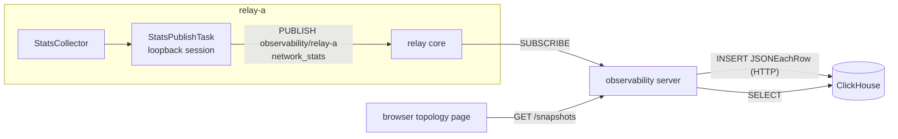

# `observability` Architecture

## Status
Design proposal (PoC). Nothing below is implemented yet; update this file in
the same change as each implementation step.

## Scope
An admin view of the relay mesh: per-session network statistics, per-track /
per-subscription delivery counters, relay memory, and the pub/sub topology
that links them, live and as history.

- Every relay publishes one snapshot per second over MoQT.
- The `observability` server subscribes to every relay, stores the snapshots in
  ClickHouse, and serves them to the browser over HTTP.
- The browser page renders the topology and plots history for a
  selected node.

Target scale: 3 relays, up to 100 clients.

## Data flow



## Track

| Field | Value |
| --- | --- |
| Track Namespace | `["observability", <RELAY_ID>]` (`RELAY_ID` already exists in `RelayConfig`) |
| Track Name | `network_stats` |
| Group | one per snapshot; Group ID = Unix time in milliseconds of the snapshot |
| Object | Object 0 only; payload is the JSON snapshot below |

A group per snapshot lets a congested subscriber skip stale snapshots and
start from the newest one. Wall-clock group ids keep a restarted relay from
reusing locations the relay cache still holds.

Topology is not a separate track: a snapshot already lists which session
publishes each track and which session subscribes to it, so the topology at
time *t* is the snapshot at *t*.

### Snapshot payload

Counters are cumulative since the session / subscription started; rates are
derived from consecutive rows at query time, so a lost snapshot loses no
traffic. Fields marked *gauge* are the value at snapshot time (or the maximum
over the last period) instead.

All statistics are measured on the relay; clients report nothing. A browser
client could not anyway: the wasm transport's `stats()` returns
`TransportStats::default()`. A QUIC endpoint only knows the loss and
congestion window of what it sends, so the relay sees the two directions of a
client session differently:

| Direction | Observable on the relay | Not observable |
| --- | --- | --- |
| Downlink (relay → client, also relay → relay) | bitrate, loss, lost bytes, cwnd, congestion events, relay blocked by the client's flow-control window, STOP_SENDING from the client, streams the relay reset, delivery lag per subscription | — |
| Uplink (client → relay) | bitrate, client blocked by the relay's flow-control window, streams the client reset, aborted subgroups, maximum object arrival gap per track, missing datagram objects | packet loss, cwnd |
| Both | RTT, minimum RTT, path MTU | — |

An inter-relay session is reported by both relays, each for its own sending
direction, so both directions of a relay → relay link are fully observed.

```json
{
  "relay_id": "relay-a",
  "timestamp_ms": 1791262800000,
  "process": {
    "rss_bytes": 123456789,
    "cache_tracks": 12,
    "cache_objects": 3456,
    "cache_payload_bytes": 98765432
  },
  "sessions": [
    {
      "session_id": 7,
      "peer": "client",
      "app_id": "ac8adbc8-a2ff-4c41-9f5e-fdaed5e1e65e",
      "rtt_us": 12000,
      "min_rtt_us": 9000,
      "current_mtu": 1452,
      "sent_bytes": 52428800,
      "sent_packets": 40000,
      "lost_packets": 120,
      "lost_bytes": 160000,
      "cwnd": 120000,
      "congestion_events": 3,
      "sent_stream_data_blocked": 0,
      "sent_data_blocked": 0,
      "received_stop_sending": 0,
      "received_bytes": 1048576,
      "received_stream_data_blocked": 0,
      "received_data_blocked": 0,
      "received_reset_stream": 0
    }
  ],
  "tracks": [
    {
      "namespace": "live/ch1",
      "name": "video",
      "publisher_session_id": 7,
      "objects_received": 900,
      "bytes_received": 1234567,
      "subgroups_aborted": 0,
      "datagram_objects_missing": 0,
      "max_arrival_gap_us": 34000
    }
  ],
  "subscriptions": [
    {
      "namespace": "live/ch1",
      "name": "video",
      "subscriber_session_id": 9,
      "request_id": 2,
      "forward": true,
      "objects_sent": 880,
      "bytes_sent": 1200000,
      "streams_opened": 30,
      "streams_reset": 0,
      "delivery_lag_us": 40000
    }
  ]
}
```

- `sessions` come from `SessionRepository` (`Session::transport_stats()`,
  `SessionPeer`, `VerifiedToken::app_id`). quinn exposes statistics per
  connection only, so there is no per-QUIC-stream entry. `TransportStats`
  (`crates/moqt`) gains the fields above that it does not carry yet, all read
  from quinn's `ConnectionStats`: `min_rtt`, `current_mtu`, `lost_bytes`,
  `udp_tx.bytes` / `udp_rx.bytes`, and the received `STREAM_DATA_BLOCKED`,
  `DATA_BLOCKED`, `RESET_STREAM` and `STOP_SENDING` frame counts. The wasm
  transport keeps returning the default.
- `tracks` come from the active upstream subscriptions plus counters kept by
  the track's ingest: objects and bytes received, subgroups that ended
  without a FIN, datagram object ids skipped within a group, and the
  *gauge* `max_arrival_gap_us` — the longest interval between two
  consecutive objects of the track since the previous snapshot. Stream data
  is retransmitted, so uplink loss shows up as arrival gaps rather than as
  missing objects.
- `subscriptions` come from the downstream registrations plus counters kept
  by each `EgressRunner`, and the *gauge* `delivery_lag_us`: snapshot time
  minus the cache `received_at` of the object the subscription sent last,
  i.e. how far behind the relay's live edge the subscriber is. It is a time,
  not a group count, because group ids may be wall-clock values with gaps.
- `rss_bytes` is `VmRSS` from `/proc/self/status` on Linux and absent
  elsewhere. glibc keeps freed memory, so RSS alone overstates live memory;
  the cache figures tell whether growth is held by the cache.

## Relay side (`crates/relay`, new `modules/observability/`)

- `StatsCollector` builds a snapshot from `SessionRepository`, the pub/sub
  directory, `TrackCacheStore` and the ingress / egress counters.
- `StatsPublishTask` (owns its `JoinHandle`) dials the relay's own inner
  endpoint with `AUTH_RELAY_TOKEN`, sends PUBLISH for
  `observability/<RELAY_ID>` / `network_stats`, and writes one group per
  second. The relay then treats the snapshot track like any published track:
  cache, fan-out, FETCH and authorization need no new code path.
- The loopback session appears in its own snapshot as a `relay` peer; the
  task reports its local address so the collector can mark it `self`.

Alternative considered: registering an in-process publisher directly in the
pub/sub directory and writing into `TrackCache`. It saves one loopback QUIC
connection but adds a second kind of publisher to the directory, the upstream
resolver, ingress ownership and session cleanup — every path that today
assumes a publisher is a session. At 1 Hz the loopback cost is negligible, so
the loopback session wins.

Cascading is not used for observability: the server connects to each relay
directly, so losing inter-relay routing does not hide the relays it affects.

## Observability server (`crates/observability`, new binary)

- Configuration: `OBSERVABILITY_RELAYS` — comma-separated `RELAY_ID=URL`
  pairs; `OBSERVABILITY_TOKEN` — client JWT with `app_id` = `observability`
  and a `subscribe` claim, so the existing `authorize` rule (first namespace
  element = `app_id`) restricts the track to holders of that token;
  `CLICKHOUSE_URL`; `OBSERVABILITY_HTTP_PORT`.
- One `RelaySubscriptionTask` per relay: connect, SUBSCRIBE
  `observability/<RELAY_ID>` / `network_stats` with the Largest Object
  filter, and reconnect with backoff when the session ends.
- `SnapshotWriter`: splits each snapshot into rows and inserts them over the
  ClickHouse HTTP interface (`INSERT … FORMAT JSONEachRow`, `async_insert=1`),
  using `reqwest`, which the workspace already depends on.
- HTTP API (`hyper`, as in `vts`):
  - `GET /snapshots/latest` — the newest snapshot of every relay (live view,
    polled every second).
  - `GET /snapshots?from=…&to=…` — snapshots in a time range (history scrub).
  - `GET /series?kind=session|track|subscription|process&key=…&from=…&to=…`
    — one entity's time series for the chart drawer.

The browser polls the server instead of subscribing over MoQT itself: one data
path for live and history, and no relay tokens in the browser.

## Storage (ClickHouse, self-hosted)

One table per snapshot section, all with the same lifecycle:

```sql
CREATE TABLE session_stats (
  ts DateTime64(3),
  relay_id LowCardinality(String),
  session_id UInt64,
  peer LowCardinality(String),
  app_id LowCardinality(String),
  rtt_us UInt64, cwnd UInt64,
  sent_packets UInt64, lost_packets UInt64, congestion_events UInt64,
  sent_stream_data_blocked UInt64, sent_data_blocked UInt64
) ENGINE = MergeTree
PARTITION BY toYYYYMMDD(ts)
ORDER BY (relay_id, session_id, ts)
TTL toDateTime(ts) + INTERVAL 7 DAY
SETTINGS ttl_only_drop_parts = 1;
```

`process_stats`, `track_stats` and `subscription_stats` follow the same
pattern. Rows older than 7 days are dropped by TTL a whole day partition at a
time; there is no capacity-based deletion. Expected volume at the target
scale is a few hundred rows per second.

ClickHouse runs as a `docker-compose.yml` service next to the relays; the
DDL lives in `crates/observability/schema.sql` and is applied at startup.

## Browser page (`examples/browser/examples/observability`)

A dark, full-width topology view of live connections and subscriptions with a
chart drawer for the selection; `mockup.html` in this directory is the
reference.

### Header
- `app_id` selector and Track Namespace prefix filter. The prefix covers the
  elements after `app_id` and matches element-wise, as SUBSCRIBE_NAMESPACE
  does: `room1` matches `room1/alice`, `room` does not. Subscriptions outside
  the filters, links carrying only them and clients left with none of them
  are hidden; relays stay. The relay's `authorize` rule makes the first
  namespace element equal the session's `app_id`, so no subscription crosses
  `app_id`s and the `app_id` filter is exact. The page filters the snapshot
  it already holds; the API takes no filter parameter.
- Time slider seeking up to the 7-day retention back; the whole page (topology,
  colours, details, chart range end) then shows the snapshot at that time,
  and its label returns to live when clicked.
- Totals: relays, clients, subscriptions, egress.

### Topology
- One circle for the hosting environment (e.g. GCP) holding the relays,
  drawn as server icons with RSS and cache size. Every client — publisher or
  viewer — is a card outside the circle on a ring, at the angle of its relay,
  since clients reach the relays from the Internet. A card shows the client,
  the Track Namespace it publishes (or, for a pure subscriber, the one it
  subscribes to) without the `app_id` element, and its published track
  count.
- One directed, animated dashed link per hop a subscription takes:
  publisher → its relay, relay → relay, relay → subscriber. Subscriptions
  sharing a hop share one link; its bitrate is the sum over publishers. Dash
  speed follows the bitrate. Downlink and inter-relay links are coloured by
  that session's loss rate; uplink links are grey because uplink loss is not
  measured. An unframed legend sits in the bottom-left corner.
- Every selection animates the view so that all highlighted nodes fit in
  the part of the topology the chart drawer leaves visible (zooming in no
  further than about 1.7× the overview scale); clearing the selection fits
  everything again. The user can then pan by dragging (a drag never counts as
  a click) and zoom with the wheel or trackpad pinch around the cursor, or
  with the +, − and fit buttons in the top-right corner; double-clicking
  empty space re-fits.

### Selection
- Clicking a client highlights the hops of its subscriptions; clicking a
  relay, those through the relay; clicking a link draws it thick and
  highlights the full route of every subscription it carries, from the
  original publisher to the subscriber (all seven `live/ch1` routes for the
  `ingest-01 → relay-a` uplink). Everything else is dimmed.
- The links whose statistics the charts show are drawn in the selection blue:
  a client's uplink and downlink, every link of a relay, or the clicked link.
- A click also sets the header filters from the subscriptions it involves —
  the `app_id` when they share one, and their longest common namespace
  prefix (`room1` for a meeting participant, none for a relay serving
  several applications). Inside an active filter a click only narrows it.
- Clicking empty space clears the selection, closes the drawer and widens
  the filter by one tuple element: `room1/bob` → `room1` → no namespace
  filter → the `app_id` the user last picked (if a click had set another) →
  all applications. `app_id` counts as the tuple's first element.

### Chart drawer
Opening on every selection, it overlays the bottom of the topology (45% of
the viewport by default, resizable by dragging its top edge) and holds:
- a details column with what charts cannot show: identity (`app_id`, relay,
  path MTU), published tracks and subscriber count, received namespaces with
  their delivery lag, routes and their namespaces for a link, tracks carried
  by an inter-relay link, and for a relay its ingress / egress split into
  clients and each peer relay plus the attached clients. Section headings
  name their link in the selection blue (`carol → relay-b`). A relay's
  sections say ingress / egress rather than uplink / downlink, which are
  named from the client's side;
- one chart per metric in the style of the GCP monitoring charts, with
  axes, gridlines and one line per series (uplink and downlink bitrate in
  one card, delivery lag per subscription in another), fed by
  `GET /series`. Every metric of the direction table above appears; a
  relay's charts are its process figures and its ingress / egress totals
  (bitrate-weighted egress loss, summed counts). A range selector picks
  15 min / 1 h / 6 h / 1 d / 7 d ending at the time slider, and hovering any
  card moves a shared crosshair that shows every card's value at that
  instant. The grid keeps its scrollbar gutter, so resizing the drawer never
  changes the column count.

With a Track Namespace filter, bitrates and track lists count only the
filtered subscriptions (from the per-subscription counters; an inter-relay
link shows only the filtered tracks it carries). Transport figures — RTT,
loss, cwnd, congestion, flow-control and reset counts — exist per QUIC
connection only, so they stay whole-session, and the details column says so.

Rendered as SVG with React. Links are per hop, not per subscription, so
their number grows with the session count (about 100 client links at the
target scale) rather than with publisher × subscriber pairs.

## Implementation steps (stacked PRs)

1. `relay`: ingress / egress object and byte counters.
2. `relay`: `StatsCollector` + `StatsPublishTask` publishing `network_stats`.
3. `observability`: subscribe to the relays and write to ClickHouse
   (crate, schema, docker-compose service).
4. `observability`: HTTP API.
5. `examples/browser`: the topology page.

The new crate's dependencies get ADRs under `docs/architecture/observability/`
(`reqwest`, `hyper`). The browser page needs no new package: the layout is a
fixed ring computed in the page.
