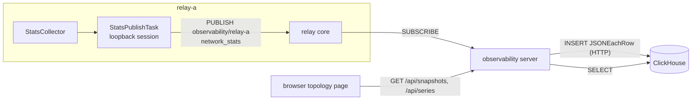

# `observability` Architecture

## Status
Living document (PoC). Update this file in the same change whenever the design
intent, module boundaries, runtime flow, or invariants described here change.

## Scope
An admin view of the relay mesh: per-session network statistics, per-track /
per-subscription delivery counters, relay memory, and the pub/sub topology
that links them, live and as history.

- Every relay publishes one snapshot per second over MoQT.
- The `observability` server subscribes to every relay, stores the snapshots in
  ClickHouse, and serves them to the browser over HTTP.
- The browser page renders the topology and plots history for a
  selected node.

Target scale: 3 relays, up to 100 clients.

## Data flow



## Track

| Field | Value |
| --- | --- |
| Track Namespace | `["observability", <RELAY_ID>]` (`RELAY_ID` already exists in `RelayConfig`) |
| Track Name | `network_stats` |
| Group | one per snapshot; Group ID = Unix time in milliseconds of the snapshot |
| Object | Object 0 only; payload is the JSON snapshot below |

A group per snapshot lets a congested subscriber skip stale snapshots and
start from the newest one. Wall-clock group ids keep a restarted relay from
reusing locations the relay cache still holds.

Topology is not a separate track: a snapshot already lists which session
publishes each track and which session subscribes to it, so the topology at
time *t* is the snapshot at *t*.

### Snapshot payload

The type is `relay_stats::RelaySnapshot` (`crates/relay-stats`). Counters are
cumulative since the session, track cache or subscription started; rates are
derived from consecutive snapshots, so a lost snapshot loses no traffic.
`…_since_last_snapshot_…` and `lag_…` fields are gauges.

All statistics are measured on the relay; clients report nothing. A browser
client could not anyway: the wasm transport's `stats()` returns
`TransportStats::default()`. A QUIC endpoint only knows the loss and
congestion window of what it sends, so the relay sees the two directions of a
client session differently:

| Direction | Observable on the relay | Not observable |
| --- | --- | --- |
| Downlink (relay → client, also relay → relay) | bitrate, loss, lost bytes, cwnd, congestion events, relay blocked by the client's flow-control window, STOP_SENDING from the client, streams the relay reset, delivery lag per subscription | — |
| Uplink (client → relay) | bitrate, client blocked by the relay's flow-control window, streams the client reset, aborted subgroups, maximum object arrival gap per track | packet loss, cwnd |
| Both | RTT, path MTU, remote address | — |

quinn 0.11.16 has no minimum RTT, and object id gaps prove nothing about
loss (draft-14 §11.3 Prior Object ID Gap lets a publisher skip ids), so
neither is reported.

```json
{
  "relay_id": "relay-a",
  "timestamp_ms": 1791262800000,
  "process": { "rss_bytes": 123456789, "cache_tracks": 12, "cache_objects": 3456, "cache_payload_bytes": 98765432 },
  "sessions": [
    {
      "session_id": 7, "peer": "client", "app_id": "ac8adbc8-a2ff-4c41-9f5e-fdaed5e1e65e",
      "remote_address": "203.0.113.5:50123", "local_ip": "10.0.0.2", "dialed_relay_id": null,
      "rtt_us": 12000, "current_mtu": 1452,
      "sent_bytes": 52428800, "sent_packets": 40000, "lost_packets": 120,
      "cwnd": 120000, "congestion_events": 3, "sent_stream_data_blocked": 0, "sent_data_blocked": 0,
      "received_stop_sending": 0, "received_bytes": 1048576, "received_stream_data_blocked": 0,
      "received_data_blocked": 0, "received_reset_stream": 0
    }
  ],
  "tracks": [
    {
      "namespace": "ac8adbc8-…/live/ch1", "name": "video", "publisher_session_id": 7,
      "bytes_received": 1234567,
      "max_arrival_gap_since_last_snapshot_us": 34000
    }
  ],
  "subscriptions": [
    {
      "namespace": "ac8adbc8-…/live/ch1", "name": "video", "publisher_session_id": 7,
      "subscriber_session_id": 9, "request_id": 2,
      "bytes_sent": 1200000, "streams_reset": 0,
      "lag_behind_newest_received_us": 40000
    }
  ]
}
```

- `peer` is `client` or `relay` from the endpoint the session arrived on,
  `stats_publisher` for the relay's own loopback session, and `stats_subscriber`
  for a session subscribed to the relay's own stats track (the observability
  server, which presents the relay token). The page hides both stats peers, and
  the relay totals in `/api/series` count only `client` and `relay` sessions.
- `dialed_relay_id` is set on an inter-relay session this relay dialed. The
  accepting relay only sees a relay token, so consumers identify the far end
  of an accepted relay session by its remote IP: a relay's addresses are the
  non-loopback `local_ip` of the sessions it accepted and the address other
  relays dialed it at. (`local_ip` is empty on a dialed session: quinn does
  not report it for a client endpoint bound to `0.0.0.0`.) This needs every
  relay on its own IP and nothing else connecting from a relay's IP (true on
  GCP and in docker compose, not for several relays, or a relay and the
  observability server, on one host).
- `max_arrival_gap_since_last_snapshot_us` is the longest interval between two
  live objects of the track since the previous snapshot. Stream data is
  retransmitted, so uplink loss shows up as arrival gaps rather than as
  missing objects.
- `lag_behind_newest_received_us` is the newest object the track received
  minus the newest object the subscription sent, both by the relay's receive
  time. It is a time, not a group count, because group ids may be wall-clock
  values with gaps.
- `rss_bytes` is `VmRSS` from `/proc/self/status` on Linux and absent
  elsewhere. glibc keeps freed memory, so RSS alone overstates live memory;
  the cache figures tell whether growth is held by the cache.

## Relay side (`crates/relay`, `modules/observability/`)

`docs/architecture/relay/architecture.md` ("Observability") describes the
collector, the loopback `StatsPublishTask` and where each counter lives.

Alternative considered: registering an in-process publisher directly in the
pub/sub directory and writing into `TrackCache`. It saves one loopback QUIC
connection but adds a second kind of publisher to the directory, the upstream
resolver, ingress ownership and session cleanup — every path that today
assumes a publisher is a session. At 1 Hz the loopback cost is negligible, so
the loopback session wins.

Cascading is not used for observability: the server connects to each relay
directly, so losing inter-relay routing does not hide the relays it affects.

## Observability server (`crates/observability`)

| Variable | Default | Meaning |
| --- | --- | --- |
| `OBSERVABILITY_RELAYS` | required | Comma-separated `RELAY_ID=URL` pairs, e.g. `relay-a=moqt://relay-a:444` |
| `OBSERVABILITY_AUTH_TOKEN` | none | JWT presented in CLIENT_SETUP |
| `OBSERVABILITY_INSECURE` | unset | Any value disables relay certificate verification |
| `CLICKHOUSE_URL` | `http://127.0.0.1:8123` | ClickHouse HTTP interface |
| `CLICKHOUSE_DATABASE` | `observability` | Created at startup with its tables |
| `CLICKHOUSE_USER` / `CLICKHOUSE_PASSWORD` | none | Basic auth |
| `OBSERVABILITY_HTTP_PORT` | `8095` | API port |

The recommended deployment connects to each relay's inner endpoint with
`AUTH_RELAY_TOKEN`: relay tokens do not expire and have full access, while a
client token (`app_id` = `observability`, `subscribe` claim) would be capped
by the relay's `AUTH_MAX_TOKEN_TTL_SECONDS` and the server does not refresh
tokens. Sessions authenticated with an `observability` client token are left
out of the topology page.

- `RelaySubscriptionTask` (one per relay): connect, SUBSCRIBE
  `observability/<RELAY_ID>` / `network_stats` with Next Group Start, decode
  each object and send it to the ingest task; reconnect 5 s after the session
  or track ends.
- `SnapshotIngestTask`: keeps the newest snapshot per relay in
  `LatestSnapshots` and writes the snapshots of every ten seconds to ClickHouse
  in one insert per table (`snapshot_rows::store`).
- `ApiServer` (`hyper`, as in `vts`, with `Access-Control-Allow-Origin: *`):
  - `GET /api/snapshots` — the newest snapshot of every relay, from memory.
  - `GET /api/snapshots?at=<ms>` — each relay's last snapshot at or before
    `at`, if it published one in the 10 s before.
  - `GET /api/namespaces?from=…&to=…[&app_id=…]` — every namespace with a
    track in the range (from `track_stats`, at most 1000, `observability/…`
    excluded), with its tracks, relays, first / last time seen and the
    number of distinct client subscriptions, plus the range's totals of
    client subscriptions and client sessions.
  - `GET /api/series?relay_id=…&target=process|relay|session|track|subscription&…&from=…&to=…&points=…`
    — the target's rows bucketed into `points` buckets (at least 1 s), with
    counters turned into per-second rates between the last samples of
    consecutive buckets (so a partly filled newest bucket is not
    underestimated) and a
    counter that went backwards (a restart) giving no value. `relay` sums
    every session of the relay; ratios such as loss are weighted by their
    denominators. Query values reach ClickHouse as typed query parameters.
    A range longer than the 7-day retention (series and namespaces) or more
    than 300 points is rejected with 400, so an anonymous caller cannot make ClickHouse scan
    more than one retention window per request.

The API has no authentication: the PoC page is published on GitHub Pages and
reads it from any origin. What it returns is therefore treated as public. A
client session's address is masked before it leaves the server
(`203.0.113.x:50123`, IPv6 keeps its first three groups); the port stays so
cards remain distinguishable. Relay addresses stay unmasked because the page
needs them to identify inter-relay sessions. ClickHouse keeps the unmasked
addresses.

The browser polls the server instead of subscribing over MoQT itself: one data
path for live and history, and no relay tokens in the browser.

## Storage (ClickHouse, self-hosted)

`schema.rs` creates five MergeTree tables, all keyed by `relay_id` and
`timestamp_ms` with `ts DateTime64(3, 'UTC')` derived from it:

| Table | Rows per snapshot | Extra key |
| --- | --- | --- |
| `snapshots` | 1 (the raw JSON, for `?at=`) | — |
| `process_stats` | 1 | — |
| `session_stats` | one per session | `session_id` |
| `track_stats` | one per track | `publisher_session_id, namespace, name` |
| `subscription_stats` | one per subscription | `subscriber_session_id, request_id` |

Every table is `PARTITION BY toYYYYMMDD(ts)` with
`TTL toDateTime(ts) + INTERVAL 7 DAY` and `ttl_only_drop_parts = 1`, so old
data leaves a whole day partition at a time; there is no capacity-based
deletion. The ingest task buffers snapshots for ten seconds and writes each
table with one insert per flush: ClickHouse turns every insert into a part
and merges it into its partition, and a part per relay snapshot kept the
merges busy on the observability VM's single shared core. The live view is
updated as each snapshot arrives, so only the history lags by up to the
flush interval. Inserts set `input_format_skip_unknown_fields`, so a field
added to `relay-stats` is ignored until a column exists for it.
Tables are created with `IF NOT EXISTS` and never altered: a new column needs
an `ALTER TABLE` (or a fresh database) by hand.

ClickHouse runs as a `docker-compose.yml` service next to the relays.

## Browser page (`examples/browser/examples/observability`)

A dark, full-width topology view of live connections and subscriptions with a
chart drawer for the selection. Served from `localhost` it reads the local
stack's API on port 8095; anywhere else, the deployed
`https://observability.moqt.research.skyway.io`.

### Header
- `app_id` selector and Track Namespace prefix filter. The prefix covers the
  elements after `app_id` and matches element-wise, as SUBSCRIBE_NAMESPACE
  does: `room1` matches `room1/alice`, `room` does not. Subscriptions outside
  the filters, links carrying only them and clients left with none of them
  are hidden; relays stay. The relay's `authorize` rule makes the first
  namespace element equal the session's `app_id`, so no subscription crosses
  `app_id`s and the `app_id` filter is exact. The page filters the snapshot
  it already holds; the API takes no filter parameter.
- Time controls: a range selector (15 min / 1 h / 6 h / 1 d / 7 d, 1 h by
  default) shared with the chart drawer, and a slider spanning that range
  up to now in 1 s steps — a 7-day slider would move about an hour per
  pixel. −10 s / +10 s buttons and ← / → (1 s, Shift for 10 s) step from
  the current position; stepping past now returns to live. The whole page
  (topology, colours, details) then shows the snapshot at that time, and the
  time label returns to live when clicked.
- A Namespaces button opens a panel listing every Track Namespace published
  in the header's range (`GET /api/namespaces`), newest first, searchable,
  with its tracks, relays, first / last time seen (Live while still
  published) and client subscriptions; its heading counts namespaces,
  subscriptions and clients in the range, scoped to the `app_id` filter.
  Clicking a row sets the `app_id` and namespace filters to it and moves the
  page to its last published moment (or stays live).

### Topology
- One circle for the hosting environment (e.g. GCP) holding the relays,
  drawn as server icons with RSS and cache size. Every client — publisher or
  viewer — is a card outside the circle on a ring, at the angle of its relay,
  since clients reach the relays from the Internet. A card shows the client,
  the Track Namespace it publishes (or, for a pure subscriber, the one it
  subscribes to) without the `app_id` element, and its published track
  count.
- One directed, animated dashed link per hop a subscription takes:
  publisher → its relay, relay → relay, relay → subscriber. Subscriptions
  sharing a hop share one link; its bitrate is the sum over publishers. Dash
  speed follows the bitrate. Downlink and inter-relay links are coloured by
  that session's loss rate; uplink links are grey because uplink loss is not
  measured. An unframed legend sits in the bottom-left corner.
- Every selection animates the view so that all highlighted nodes fit in
  the part of the topology the chart drawer leaves visible (zooming in no
  further than about 1.7× the overview scale); clearing the selection fits
  everything again. The user can then pan by dragging (a drag never counts as
  a click) and zoom with the wheel or trackpad pinch around the cursor, or
  with the +, − and fit buttons in the top-right corner; double-clicking
  empty space re-fits.

### Selection
- Clicking the "Relays" label of the environment selects the whole mesh:
  nothing is dimmed, and the drawer shows each relay's clients, ingress,
  egress and RSS with charts of egress, ingress, loss, sessions, RSS, cache
  and congestion per relay plus an all-relays total line.
- Clicking a client highlights the hops of its subscriptions; clicking a
  relay, those through the relay; clicking a link draws it thick and
  highlights the full route of every subscription it carries, from the
  original publisher to the subscriber (all seven `live/ch1` routes for the
  `ingest-01 → relay-a` uplink). Everything else is dimmed.
- The links whose statistics the charts show are drawn in the selection blue:
  a client's uplink and downlink, every link of a relay, or the clicked link.
- A click also sets the header filters from the subscriptions it involves —
  the `app_id` when they share one, and their longest common namespace
  prefix (`room1` for a meeting participant, none for a relay serving
  several applications). Inside an active filter a click only narrows it.
- Clicking empty space clears the selection, closes the drawer and widens
  the filter by one tuple element: `room1/bob` → `room1` → no namespace
  filter → the `app_id` the user last picked (if a click had set another) →
  all applications. `app_id` counts as the tuple's first element.

### Chart drawer
Opening on every selection, it overlays the bottom of the topology (45% of
the viewport by default, resizable by dragging its top edge) and holds:
- a details column with what charts cannot show: identity (`app_id`, relay,
  path MTU), published tracks and subscriber count, received namespaces with
  their delivery lag, routes and their namespaces for a link, tracks carried
  by an inter-relay link, and for a relay its ingress / egress split into
  clients and each peer relay plus the attached clients. Section headings
  name their link in the selection blue (`carol → relay-b`). A relay's
  sections say ingress / egress rather than uplink / downlink, which are
  named from the client's side;
- one chart per metric in the style of the GCP monitoring charts, with
  axes, gridlines and one line per series (uplink and downlink bitrate in
  one card, delivery lag per subscription in another), fed by
  `GET /series`. Every metric of the direction table above appears; a
  relay's charts are its process figures and its ingress / egress totals
  (bitrate-weighted egress loss, summed counts). The charts cover the header's
  range up to now and mark the selected past time with a vertical line;
  hovering any card moves a shared crosshair that shows every card's value
  at that instant, and clicking a card moves the whole page to that time. The grid keeps its scrollbar gutter, so resizing the drawer never
  changes the column count.

With a Track Namespace filter, bitrates and track lists count only the
filtered subscriptions (from the per-subscription counters; an inter-relay
link shows only the filtered tracks it carries). Transport figures — RTT,
loss, cwnd, congestion, flow-control and reset counts — exist per QUIC
connection only, so they stay whole-session, and the details column says so.

A route is built backwards from each subscription of a client: the track's
publisher session on that relay is either a client (the original publisher)
or an inter-relay session, whose far relay is found as described under
"Snapshot payload" and searched for the same track, up to four relays deep.
Bitrates come from consecutive snapshots of the same relay, so the page keeps
the previous snapshot per relay and only advances it when the relay's
timestamp moved.

Rendered as SVG with React. Links are per hop, not per subscription, so
their number grows with the session count (about 100 client links at the
target scale) rather than with publisher × subscriber pairs.

## Dependencies

The crate's dependencies have ADRs in this directory (`reqwest.md`,
`hyper.md`). The browser page needs no new package.
