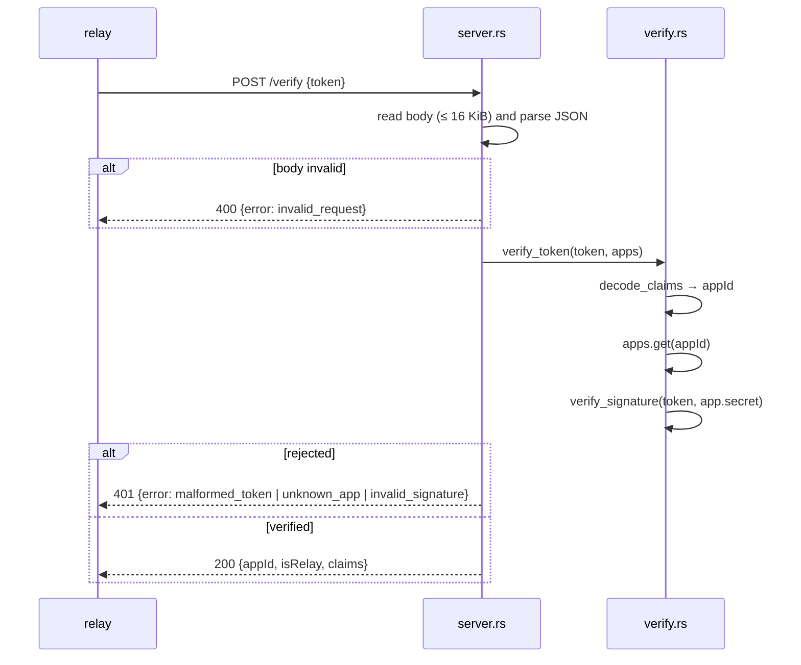

# `vts` Architecture

## Status
Living document. Update this file in the same change whenever the design intent,
module boundaries, runtime flow, or invariants described here change.

## Scope
The `vts` crate is the Verify Token Service: an HTTP service the relay calls
once per session to check that a client's JWT was signed with the secret of a
registered app, and whether that app is a relay. It also ships `vts-mint`, the
operator CLI that signs tokens from the same apps file.

The service deliberately answers only the signature question. Token lifetime
(`iat`, `exp`, the maximum TTL, clock leeway) and the meaning of `publish` /
`subscribe` are the relay's policy (`crates/relay/src/modules/auth/`), so one
clock and one rule set govern both accepting a session and expiring it later.

## Modules

| Module | Responsibility |
| --- | --- |
| `apps.rs` | Parse the apps file into `Apps` (`HashMap<appId, App { secret, is_relay }>`). serde enforces the row shape (`appId`, `secret`, boolean `isRelay`); empty strings and duplicate `appId`s are rejected explicitly. |
| `jwt.rs` | Compact JWS: `sign_token` (HS256, header fixed to `{"alg":"HS256"}`), `decode_claims` (payload only, no signature check) and `verify_signature`. HMAC uses `ring`. |
| `verify.rs` | `verify_token`: decode claims → require string `appId` → look up the app → verify the signature with that app's secret. Returns `VerifiedToken { app_id, is_relay, claims }` or a `RejectReason`. |
| `server.rs` | `VtsServer`: owns the accept-loop `JoinHandle`; one `tokio::spawn` per connection running hyper HTTP/1. Routes `GET /healthz` and `POST /verify`; everything else is 404. |
| `mint.rs` | `MintRequest` (also the clap argument group of `vts-mint`) and `mint_token`: fills `auth_token::Claims` with `iat` / `exp` and signs it; `parse_ttl` for `30m` / `12h` / `365d`. |
| `main.rs` | Reads `VTS_PORT` and `VTS_APPS_FILE`, loads the apps once, binds `0.0.0.0:<port>` and serves until the process is terminated. |
| `bin/vts-mint.rs` | `vts-mint` CLI: `--apps` plus the `MintRequest` arguments, over `mint_token`. |

## Request flow

## Invariants

- `claims` in the 200 response is the signed payload as-is. The VTS never
  adds, removes or interprets claims; the relay's `SignedToken` reads them.
- Rejections are reported in the order they are detected: `malformed_token`
  (not three segments, payload not a JSON object, or no non-empty string
  `appId`), then `unknown_app`, then `invalid_signature`. A header whose
  `alg` is anything other than `HS256` is `invalid_signature`, matching the
  previous Node.js implementation built on `jose`, so the relay's
  `AuthenticationError` mapping is unchanged.
- Signing secrets exist only in the apps file. The relay never receives them.
- The apps file is read once at startup; a rotation is a restart.

## Operational notes

- Logging goes through `tracing`: `verify ok` / `verify rejected` at INFO,
  per-connection HTTP errors at DEBUG. `RUST_LOG` filters.
- The Docker image (`crates/vts/Dockerfile`) is a `cargo-chef` build onto
  `distroless/cc`, the same base as the relay, and ships both `vts` and
  `vts-mint`.
