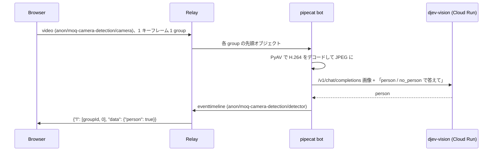

# moq-camera-detection

ブラウザの MoQ Camera Detection ページ（`examples/browser/examples/moq-camera-detection`）が H.264 で配信したカメラ映像を
pipecat の bot が受け取り、Cloud Run 上の djev-vision（[djev-run](https://github.com/taeold/djev-run) の画像対応版）で
人が映っているかを判定します。判定結果は MSF の event timeline として publish され、ページに表示されます。



## djev-vision

djev-run を `--language-model-only` なしで起動し、画像を受け付けるようにした Cloud Run サービス `djev-vision`（asia-southeast1）です。
vLLM の画像前処理キャッシュは API とエンジンのプロセス間でずれるため、`--mm-processor-cache-gb 0` で無効にしています。
IAM 認証が必須なので、bot を起動するアカウントには `roles/run.invoker` が必要です。停止後の最初の判定はコールドスタートで約 3 分かかります。

vLLM は拡散モデルの出力を選択肢に縛れない（structured outputs 非対応）ため、プロンプトで `person` / `no_person` を指定し、
返答の最終行を読みます。どちらでもなければ「判定できません」と表示します。

## 起動

各コマンドを別々のターミナルで実行します。

1. relay を起動する（Cloud relay を使う場合は不要）

   ```shell
   make relay
   ```

2. bot を起動する

   ```shell
   cd examples/python/moq-camera-detection
   uv run python -m moq_camera_detection.bot --insecure \
     --djev-url "$(gcloud run services describe djev-vision --region asia-southeast1 --format 'value(status.url)')/v1/chat/completions" \
     --gcloud-auth
   ```

   Cloud relay を使う場合は `--insecure` の代わりに `--relay-url https://relay-1.moqt.research.skyway.io:443` を渡します。

3. ページを開く

   ```shell
   make browser
   make chrome
   ```

   ハブから MoQ Camera Detection を開き、bot と同じ relay を選んで Join します（既定は Cloud relay-1）。Cloud relay だけを使う場合、
   `make chrome` は不要です。

## トラック

| namespace | track | 送信元 | 内容 |
| --- | --- | --- | --- |
| `anon/moq-camera-detection/camera` | `video` | ブラウザ | H.264 Annex B（640x480、ソフトウェアエンコード）。キーフレームごとに group を始める |
| `anon/moq-camera-detection/detector` | `eventtimeline` | bot | draft-ietf-moq-msf-01 §8 の event timeline。`l` で判定した group の先頭を指す |

- bot は各 group の先頭（キーフレーム）だけをデコードします。判定に 2 秒以上遅れたキーフレームは捨てるので、
  コールドスタート中にたまったフレームは判定されません。
- ブラウザはハードウェアエンコーダを使いません。macOS のハードウェアエンコーダは、偽カメラのファイル入力など一部のフレームで
  数フレーム出力したあと止まるためです。

## テスト

```shell
uv run pytest
```

E2E はリポジトリのルートで実行します。relay・VTS・vite・偽の判定サーバ・bot を起動し、Playwright の偽カメラでページを操作します。

```shell
node scripts/run-camera-detection-e2e.mjs
```
