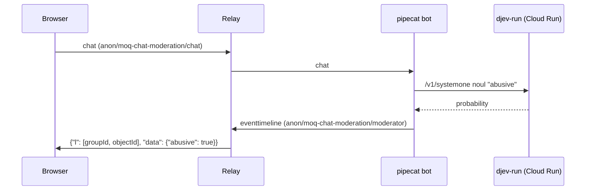

# moq-chat-moderation

ブラウザの MoQ Chat Moderation ページ（`examples/browser/examples/moq-chat-moderation`）で打ったチャットを
pipecat の bot が `MOQTransport` で受け取り、Cloud Run 上の [djev-run](https://github.com/taeold/djev-run) で暴言かどうかを判定します。
判定結果は MSF の event timeline として publish され、ページは暴言のメッセージを「モデレーターによって削除されました」に置き換えます。



## djev-run

djev-run は Jev 互換の `/v1/systemone` を返す Cloud Run サービス `djev-dgemma`（asia-southeast1）として動いています。
IAM 認証が必須なので、bot を起動するアカウントには `roles/run.invoker` が必要です。bot は `--gcloud-auth` を付けると
`gcloud auth print-identity-token` の ID トークンを Bearer で送ります。GCE の VM では `--metadata-auth` を付けると、VM のサービスアカウントの ID トークンをメタデータサーバーから取って送ります。`--min-instances=0` のため、しばらく使われずに停止した後の最初の判定は、コールドスタートで約 3 分かかります。
デプロイ手順は [djev-run を Cloud Run にデプロイする](../djev-run-on-cloud-run.md) にあります。

## 起動

Cloud relay-1 には、常時動いている bot がつながっています。Cloud relay で試すだけなら bot を起動する必要はなく、
ページを開いて既定の Cloud relay-1 のまま Join します。

手元の bot を Cloud relay につなぐと Cloud の bot と同じページを二重に処理するため、relay も手元で起動します。
各コマンドを別々のターミナルで実行します。

1. relay を起動する

   ```shell
   make relay
   ```

2. bot を起動する

   ```shell
   cd examples/python/moq-chat-moderation
   uv run python -m moq_chat_moderation.bot --insecure \
     --jev-url "$(gcloud run services describe djev-dgemma --region asia-southeast1 --format 'value(status.url)')/v1/systemone" \
     --gcloud-auth
   ```

   `--insecure` は手元の relay の自己署名証明書を検証しない指定です。

3. ページを開く

   ```shell
   make browser
   make chrome
   ```

   `make chrome` で起動した Chrome でハブから MoQ Chat Moderation を開き、Local relay-a を選んで Join します。
   モデレーター接続済みになったら送信できます。

## トラック

| namespace | track | 送信元 | 内容 |
| --- | --- | --- | --- |
| `anon/moq-chat-moderation/chat` | `chat` | ブラウザ | `{"text", "location": [groupId, objectId]}`。1 メッセージ 1 group |
| `anon/moq-chat-moderation/moderator` | `eventtimeline` | bot | draft-ietf-moq-msf-01 §8 の event timeline。`l` で chat の Location を指す |

- pipecat の `MOQTransport` は peer の transcript トラックを moq-rs の圧縮 JSON stream として読みます。ブラウザは
  各レコードを DEFLATE の stored block で包み、group の先頭 object として送ります。
- chat の group id と eventtimeline の group id は wall clock から採番します。relay は publisher が替わっても
  track のキャッシュを保持し、同じ Location を再利用した track を隔離するためです。
- `MOQTransport` は peer を 1 つしか扱わないので、チャットを送るページは同時に 1 つです。

## テスト

```shell
uv run pytest
```

E2E はリポジトリのルートで実行します。relay・VTS・vite・偽の djev-run・bot を起動し、Playwright でページを操作します。

```shell
node tests/browser-e2e/run-chat-moderation-e2e.mjs
```
