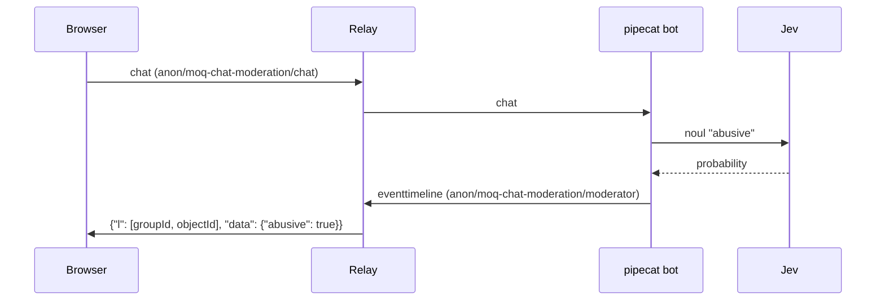

# moq-chat-moderation

ブラウザの MoQ Chat Moderation ページ（`examples/browser/examples/moq-chat-moderation`）で打ったチャットを
pipecat の bot が `MOQTransport` で受け取り、[Jev](https://docs.typesafe.ai/api) で暴言かどうかを判定します。
判定結果は MSF の event timeline として publish され、ページは暴言のメッセージを「モデレーターによって削除されました」に置き換えます。



## 起動

各コマンドを別々のターミナルで実行します。bot には TypeSafe の API キーが必要です。

1. relay を起動する

   ```shell
   make relay
   ```

2. bot を起動する

   `.env.example` を `.env` にコピーして `JEV_API_KEY` を書きます。`.env` は git 管理外です。

   ```shell
   cd examples/python/moq-chat-moderation
   cp .env.example .env
   uv run --env-file .env python -m moq_chat_moderation.bot --insecure
   ```

   `--insecure` はローカル relay の自己署名証明書を検証しない指定です。Cloud relay を使う場合は relay の起動を省き、
   `--insecure` の代わりに `--relay-url https://relay-1.moqt.research.skyway.io:443` を渡します。

3. ページを開く

   ```shell
   make browser
   make chrome
   ```

   ハブから MoQ Chat Moderation を開き、bot と同じ relay を選んで Join します（既定は Cloud relay-1）。
   モデレーター接続済みになったら送信できます。Cloud relay だけを使う場合、`make chrome` は不要です。

## トラック

| namespace | track | 送信元 | 内容 |
| --- | --- | --- | --- |
| `anon/moq-chat-moderation/chat` | `chat` | ブラウザ | `{"text", "location": [groupId, objectId]}`。1 メッセージ 1 group |
| `anon/moq-chat-moderation/moderator` | `eventtimeline` | bot | draft-ietf-moq-msf-01 §8 の event timeline。`l` で chat の Location を指す |

- pipecat の `MOQTransport` は peer の transcript トラックを moq-rs の圧縮 JSON stream として読みます。ブラウザは
  各レコードを DEFLATE の stored block で包み、group の先頭 object として送ります。
- chat の group id と eventtimeline の group id は wall clock から採番します。relay は publisher が替わっても
  track のキャッシュを保持し、同じ Location を再利用した track を隔離するためです。
- `MOQTransport` は peer を 1 つしか扱わないので、チャットを送るページは同時に 1 つです。

## テスト

```shell
uv run pytest
```

E2E はリポジトリのルートで実行します。relay・VTS・vite・偽の Jev・bot を起動し、Playwright でページを操作します。

```shell
node scripts/run-chat-moderation-e2e.mjs
```
