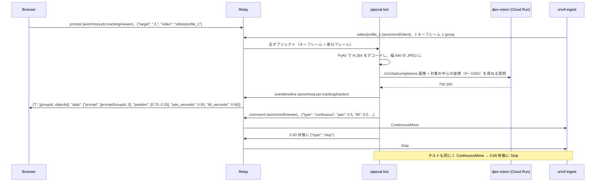

# moq-ptz-tracking

`onvif-ingest` が配信する ONVIF カメラの映像を pipecat の bot が受け取り、ブラウザの MoQ PTZ Tracking ページ
（`examples/browser/examples/moq-ptz-tracking`）で指定した対象が映像のどこにあるかを Cloud Run 上の djev-vision に尋ねます。
対象が中央から外れていれば、`onvif-ingest` に ContinuousMove と Stop を送ってカメラを対象の方へ向けます。



## 追従のしかた

- djev-vision には、対象の中心の座標を横・縦それぞれ 0〜1000 で答えさせます。0〜100 を指定すると 0〜1000 で答えることが
  多く目盛りが曖昧になるため、モデルが使い慣れた 0〜1000 にしています。返答の最終行を読み、`none` なら「映っていない」です。
- 中心からのずれに比例した時間だけ、速度 0.5 の ContinuousMove でパン、続いてチルトを動かし、Stop で止めます。
  ずれ ÷ `--pan-per-second`（`--tilt-per-second`）秒動かします。ずれが `--dead-zone` 未満の軸は動かしません。
  ONVIF では正のパンが右、正のチルトが上です。
- 判定は 1 枚ずつ行い、カメラを動かしている間は判定しません。Stop から 1 秒たってからデコードした画像だけを
  次の判定に使います。カメラは Stop から 0.3 秒以内に止まり、撮影から bot のデコードまで約 0.4 秒かかるため、
  動いている途中の画像で判定して同じ方向へ動かしすぎることはありません。
- デコードから 2 秒以上たった画像は判定しません。判定中にページが対象を変えたり追従を止めたりした場合、
  その判定ではカメラを動かしません。

`--pan-per-second` と `--tilt-per-second` は、速度 0.5 の ContinuousMove で 1 秒動かしたときに映像が動く量を、
画面の幅（高さ）に対する割合で表した値です。正のパンで左に回るカメラでは、`--pan-per-second` を負の値にします。

Tapo C2xx（2304x1296）で測った値（既定値はこれに合わせています）:

| コマンド | 視野の動き |
| --- | --- |
| パン 0.5 を 0.3 / 0.6 / 1.0 秒 | 画面幅の約 7.5 / 16 / 27%、右へ（`--pan-per-second 0.27`） |
| チルト 0.5 を 0.3 / 0.6 / 1.0 秒 | 画面の高さの約 12 / 22 / 37%、上へ（`--tilt-per-second 0.38`） |

このカメラは RelativeMove の最小値 0.3（それ未満はモーターが空回りする）でも画面幅の半分ほど動き、
中央付近の対象を合わせられないため ContinuousMove を使います。RelativeMove ではパンが逆向きですが、
ContinuousMove では逆になりません。

## 起動

ONVIF カメラは手元のネットワークにあるため、relay・`onvif-ingest`・bot をすべて手元で起動します。
各コマンドは別々のターミナルで実行します。

1. relay を起動する

   ```shell
   make relay
   ```

2. ONVIF カメラを配信する

   リポジトリのルートの `.env` に `ONVIF_IP`・`ONVIF_USERNAME`・`ONVIF_PASSWORD` を設定します。

   ```shell
   make onvif
   ```

3. bot を起動する

   ```shell
   cd examples/python/moq-ptz-tracking
   uv run python -m moq_ptz_tracking.bot --insecure \
     --djev-url "$(gcloud run services describe djev-vision --region asia-southeast1 --format 'value(status.url)')/v1/chat/completions" \
     --gcloud-auth
   ```

   `--insecure` は手元の relay の自己署名証明書を検証しない指定です。djev-vision の認証とコールドスタート（約 3 分）は
   [moq-camera-detection](../moq-camera-detection/README.md#djev-vision) と同じです。

4. ページを開く

   ```shell
   make browser
   make chrome
   ```

   `make chrome` で起動した Chrome でハブから MoQ PTZ Tracking を開き、Local relay-a のまま Join します。
   追従する対象を入力して「追従」を押すと bot がカメラを動かし始め、「停止」かページを閉じると止まります。

## トラック

| namespace | track | 送信元 | 内容 |
| --- | --- | --- | --- |
| `anon/moq-ptz-tracking/viewer` | `prompt` | ブラウザ | `{"target": "...", "video": "<映像トラック名>"}` で追従を始め、`{"target": null}` で止める。1 件 1 group。対象は 100 文字以内 |
| `anon/onvif/client` | `video/profile_N` | `onvif-ingest` | H.264 Annex B の LOC。bot は prompt の `video` のトラックを、追従している間だけ subscribe する |
| `anon/onvif/viewer` | `command` | bot | `onvif-ingest` の PTZ コマンド。1 件 1 group で `{"type": "relative", ...}` を送る。ONVIF ページも同じトラックに送る |
| `anon/moq-ptz-tracking/tracker` | `eventtimeline` | bot | draft-ietf-moq-msf-01 §8 の event timeline。`l` で判定したフレーム、`data.prompt` で使った prompt の位置を指す。`data.position` は対象の中心（画面に対する割合）、映っていなければ `"not visible"`、読めなければ `null` |
| `anon/moq-ptz-tracking/tracker` | `status` | bot | djev-vision の起動状態（[moq-camera-detection](../moq-camera-detection/README.md) と同じ） |

- ページは自分が再生している映像トラックを prompt で伝えます。`onvif-ingest` は最初に subscribe されたプロファイルしか
  配信しないため、bot は別のプロファイルを選びません。
- bot が group の途中で subscribe すると、relay はその group を途中のオブジェクトから送ります（draft-14 §9.7）。moq ライブラリは
  オブジェクト 0 から始まらない group を読めないため、bot はその group を飛ばして次の group から判定します。
- relay とのセッションが閉じると、bot は 2 秒後に接続し直します。

## テスト

```shell
uv run pytest
```
