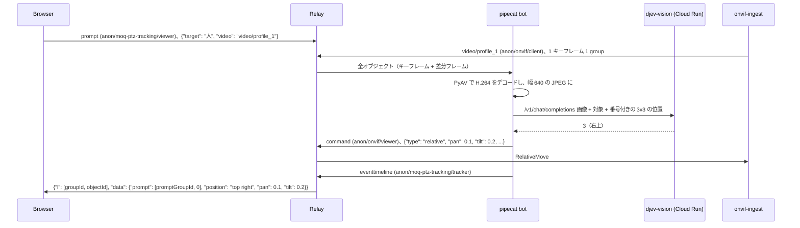

# moq-ptz-tracking

`onvif-ingest` が配信する ONVIF カメラの映像を pipecat の bot が受け取り、ブラウザの MoQ PTZ Tracking ページ
（`examples/browser/examples/moq-ptz-tracking`）で指定した対象が映像のどこにあるかを Cloud Run 上の djev-vision に尋ねます。
対象が中央から外れていれば、`onvif-ingest` に RelativeMove を送ってカメラを対象の方へ向けます。



## 追従のしかた

- djev-vision には、映像を 3x3 に分けた 9 つの位置と「映っていない」の 10 択で答えさせます。拡散モデルの出力は選択肢に
  縛れないため、返答の最終行の先頭の数字を読みます（[moq-camera-detection](../moq-camera-detection/README.md) と同じ）。
- 対象が中央以外のマスにあれば、列の分だけパン、行の分だけチルトする RelativeMove を 1 回送ります。
  ONVIF では正のパンが右、正のチルトが上です。中央にあるか、映っていなければカメラは動かしません。
- 判定は 1 枚ずつ行い、カメラを動かしたら 1.5 秒待ってからデコードした画像だけを次の判定に使います。
  動く前の画像で判定して同じ方向へ動かしすぎないためです。デコードから 2 秒以上たった画像は判定しません。
- 判定中にページが対象を変えたり追従を止めたりした場合、その判定ではカメラを動かしません。

1 回に動かす量は `--pan-step`（既定 0.3）と `--tilt-step`（既定 0.3）で、カメラの RelativeMove の座標系での値です。
カメラによって 1 あたりの角度が違うので、行き過ぎるなら小さく、届かないなら大きくします。1 回の移動を中央のマスの
幅（画面の 1/3）より小さくしておくと、中央を挟んで行ったり来たりしません。正のパンで左に回るカメラでは負の値を指定します。

Tapo C2xx（2304x1296）で測った値:

| コマンド | 視野の動き |
| --- | --- |
| パン 0.1 | 画面幅の約 9%、左へ（逆向きなので `--pan-step` は負の値にする） |
| チルト 0.1 | 画面の高さの約 3%、上へ |

このカメラは 0.3 未満の RelativeMove ではモーターが空回りする音がするので、0.3 以上を指定します。

## 起動

ONVIF カメラは手元のネットワークにあるため、relay・`onvif-ingest`・bot をすべて手元で起動します。
各コマンドは別々のターミナルで実行します。

1. relay を起動する

   ```shell
   make relay
   ```

2. ONVIF カメラを配信する

   リポジトリのルートの `.env` に `ONVIF_IP`・`ONVIF_USERNAME`・`ONVIF_PASSWORD` を設定します。

   ```shell
   make onvif
   ```

3. bot を起動する

   ```shell
   cd examples/python/moq-ptz-tracking
   uv run python -m moq_ptz_tracking.bot --insecure \
     --djev-url "$(gcloud run services describe djev-vision --region asia-southeast1 --format 'value(status.url)')/v1/chat/completions" \
     --gcloud-auth --pan-step -0.3
   ```

   `--pan-step -0.3` は Tapo のようにパンが逆向きのカメラ用の指定です。`--insecure` は手元の relay の自己署名証明書を検証しない指定です。djev-vision の認証とコールドスタート（約 3 分）は
   [moq-camera-detection](../moq-camera-detection/README.md#djev-vision) と同じです。

4. ページを開く

   ```shell
   make browser
   make chrome
   ```

   `make chrome` で起動した Chrome でハブから MoQ PTZ Tracking を開き、Local relay-a のまま Join します。
   追従する対象を入力して「追従」を押すと bot がカメラを動かし始め、「停止」かページを閉じると止まります。

## トラック

| namespace | track | 送信元 | 内容 |
| --- | --- | --- | --- |
| `anon/moq-ptz-tracking/viewer` | `prompt` | ブラウザ | `{"target": "...", "video": "<映像トラック名>"}` で追従を始め、`{"target": null}` で止める。1 件 1 group。対象は 100 文字以内 |
| `anon/onvif/client` | `video/profile_N` | `onvif-ingest` | H.264 Annex B の LOC。bot は prompt の `video` のトラックを、追従している間だけ subscribe する |
| `anon/onvif/viewer` | `command` | bot | `onvif-ingest` の PTZ コマンド。1 件 1 group で `{"type": "relative", ...}` を送る。ONVIF ページも同じトラックに送る |
| `anon/moq-ptz-tracking/tracker` | `eventtimeline` | bot | draft-ietf-moq-msf-01 §8 の event timeline。`l` で判定したフレーム、`data.prompt` で使った prompt の位置を指す |
| `anon/moq-ptz-tracking/tracker` | `status` | bot | djev-vision の起動状態（[moq-camera-detection](../moq-camera-detection/README.md) と同じ） |

- ページは自分が再生している映像トラックを prompt で伝えます。`onvif-ingest` は最初に subscribe されたプロファイルしか
  配信しないため、bot は別のプロファイルを選びません。
- bot が group の途中で subscribe すると、relay はその group を途中のオブジェクトから送ります（draft-14 §9.7）。moq ライブラリは
  オブジェクト 0 から始まらない group を読めないため、bot はその group を飛ばして次の group から判定します。
- relay とのセッションが閉じると、bot は 2 秒後に接続し直します。

## テスト

```shell
uv run pytest
```
