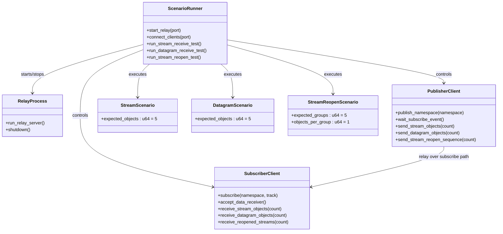

# Integration Tests
## preconditions
- issue cert and key for the localhost.
- `client` should use moqt module directly.
- `relay` should use `relay/src/main.rs`

## Class Diagram


## Test Cases
### test name: publish_namespace
- sequence
```
1. activate `relay`
2. `client A`: Endpoint::<QUIC>::create_client_with_custom_cert
->connect
->publish_namespace
```
- assert: result of `publish_namespace` is `Ok`

### test name: publish_namespace_already_subscribed
- sequence
```
1. activate `relay`
2. `client A`: Endpoint::<QUIC>::create_client_with_custom_cert
->connect
->publish_namespace with 'room/member'
3. `client B`: Endpoint::<QUIC>::create_client_with_custom_cert
->accept_connection
->subscribe_namespace with 'room'
```

- assert:
  - result of publish_namespace of `client A` is OK
  - result of subscribe_namespace of `client B` is OK
  - `client B` gets notification of `PublishNamespace`

### test name: Subscribe Stream
- sequence
```
1. activate `relay`
2. `client A`: Endpoint::<QUIC>::create_client_with_custom_cert
->connect
->publish_namespace with 'room/member'
->get subscribe message then create `DataSender`.
->send `SubgroupHeader` out at first, send `SubgroupObjectField` after the first.
->send 10 `SubgroupObjectField`, then increment group id and send `SubgroupHeader`.
3. `client B`: Endpoint::<QUIC>::create_client_with_custom_cert
->accept_connection
->subscribe_namespace with 'room'
->get session event of `publish_namespace` then subscribe 'room/member'
->receive_data from `DataReceiver`
```

- assert:
  - result of publish_namespace of `client A` is OK
  - result of subscribe_namespace of `client B` is OK
  - `client B` gets notification of `PublishNamespace`