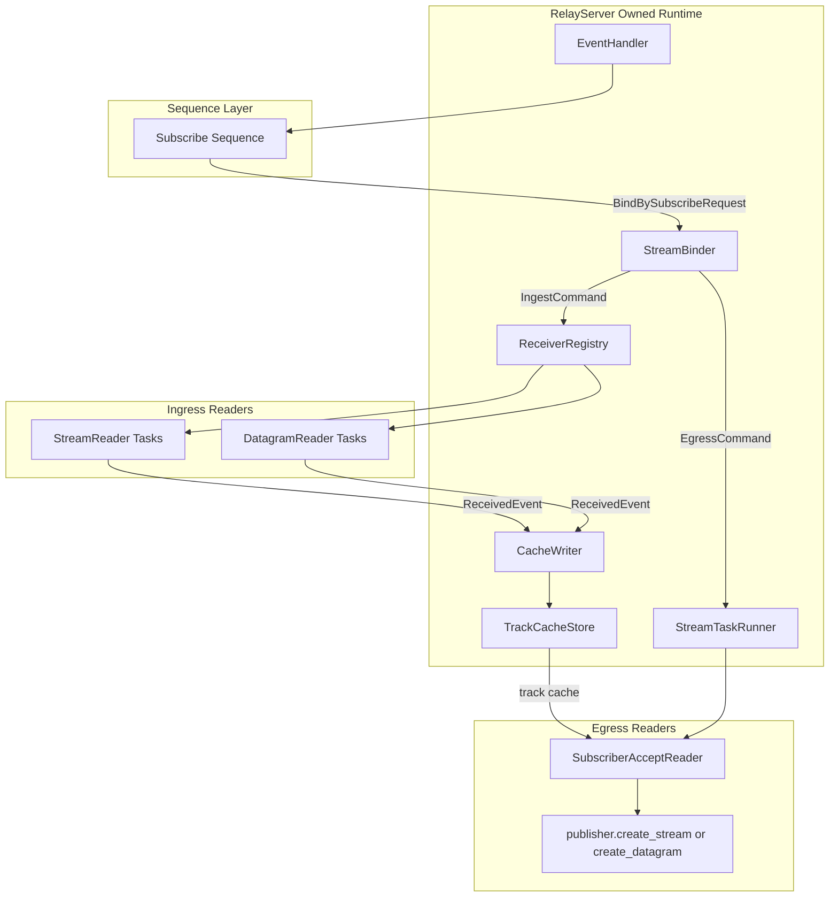
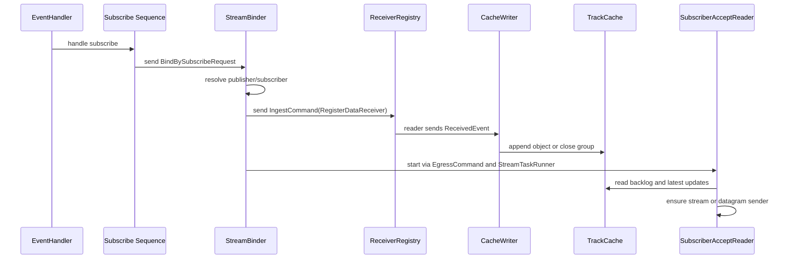

# Relay Runtime Design (Current)

## 目的

- relay の実装と設計ドキュメントの乖離をなくし、現状コードの責務とデータ経路を明確化する
- RelayServer 初期化時に起動される runtime コンポーネントの所有関係を定義する
- subscribe 起点の ingest/egress 委譲処理を mpsc ベースで整理する

## 現在の所有関係

RelayServer は以下の runtime コンポーネントをメンバとして保持する。

- `stream_binder: StreamBinder`
- `ingest_receiver_registry: Arc<ReceiverRegistry>`
- `ingest_cache_writer: CacheWriter`
- `egress_stream_runner: Arc<StreamTaskRunner>`
- `cache_store: Arc<TrackCacheStore>`
- `manager: EventHandler`

この構成により、StreamBinder/ingest/egress/cache の生存期間は RelayServer と一致する。

## 起動シーケンス

1. RelayServer::new が SessionRepository と session event channel を生成
2. TrackCacheStore を生成
3. CacheWriter を生成して ReceivedEvent queue を起動
4. ReceiverRegistry を生成し、CacheWriter sender を注入
5. StreamTaskRunner を生成
6. StreamBinder を生成し、cache_store/receiver_registry/stream_runner/session_repo を注入
7. StreamBinder sender を EventHandler に渡して session watcher task を起動

## コンポーネント責務

### EventHandler

- session event を受信し、sequence 層へ振り分ける
- Subscribe イベント時のみ StreamBinder sender を使って bind 要求を送る
- StreamBinder 実体は保持しない

### StreamBinder

- subscribe 由来の `BindBySubscribeRequest` を command queue で受理
- 内部で 3 種の非同期経路を分離
    - command queue: bind 要求処理
    - ingest queue: DataReceiver 登録処理
    - egress queue: subscriber 向け reader 起動処理
- Stream の場合は追加 accept ループを stream runner へ登録し、同一 track の後続 stream を ingest へ委譲

### ReceiverRegistry (ingest)

- `DataReceiver::Stream` / `DataReceiver::Datagram` を判定し、対応 reader task を生成
- track ごとに task handle を保持し、drop で abort

### CacheWriter (ingest)

- `ReceivedEvent` を単一 writer task で処理
- `TrackCacheStore` を更新し、必要に応じて group 作成・object 追記・group close を反映

### TrackCacheStore / TrackCache (cache)

- `TrackKey -> Arc<TrackCache>` を保持
- egress 側は track 単位に cache を取得して購読・再送する

### SubscriberAcceptReader (egress)

- cache の backlog と最新通知を見ながら送信対象 object を決定
- transport が Stream の場合、group 単位で sender を確保
- transport が Datagram の場合、単一 sender を確保
- subgroup header の再送制御を cursor と連携して行う

## チャネル一覧

- `session_receiver: mpsc::UnboundedReceiver<MOQTMessageReceived>`
    - SessionHandler -> EventHandler
- `command_sender: mpsc::Sender<BindBySubscribeRequest>(512)`
    - Subscribe sequence -> StreamBinder
- `ingest_sender: mpsc::Sender<IngestCommand>(512)`
    - StreamBinder(command) -> StreamBinder(ingest)
- `egress_sender: mpsc::Sender<EgressCommand>(512)`
    - StreamBinder(command) -> StreamBinder(egress)
- `cache_writer_sender: mpsc::Sender<ReceivedEvent>(1024)`
    - ReceiverRegistry readers -> CacheWriter
- `latest_notifier: broadcast::Sender<LatestCacheEvent>(512)`
    - TrackCache -> SubscriberAcceptReader

## ランタイムデータフロー

## Subscribe 起点の処理順

## 重要な挙動

- Stream 再オープン時は subgroup header を契機に送信用 stream を再確保する
- cursor は backlog を優先し、最新通知のみで読み飛ばさない
- stream/datagram の違いは ingest reader と egress sender 確保ロジックで吸収する

## 停止と drop

- RelayServer drop 時に各 runtime コンポーネントの状態をログ出力する
- EventHandler drop: session watcher を abort
- StreamBinder drop: command/ingest/egress runner を abort
- ReceiverRegistry drop: 保持する reader task を abort
- CacheWriter drop: writer task を abort

## 既知の設計メモ

- queue 容量は現在固定値 (512/1024) のため、負荷に応じた調整余地がある
- bind 処理で publisher/subscriber を解決するロジックは session 種別の明確化余地がある