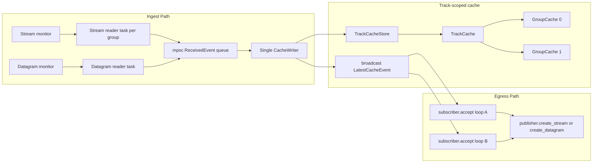
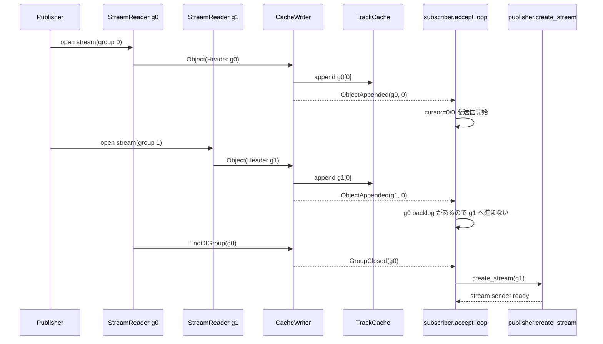

# Relay Cache Design

## 方針

- 実装は `relay/src/modules/relay` 配下に新設する
- `TrackKey = (session_id << 64) | track_alias` を relay 内の一意キーとする
- cache への書き込みは `TrackKey` ごとではなく、relay 全体で 1 本の writer task に集約する
- Stream と Datagram は受信レイヤで共通イベントへ正規化し、cache 自体は入力ソース差異を意識しない
- subscriber への再送は cache 内の読み出し位置を cursor として管理し、既存キャッシュを飛ばして最新だけ送る動作は禁止する

## 用語対応

- 本設計での reader は `subscriber.accept` の処理系を指す
- 本設計での sender 生成は `publisher.create_stream` / `publisher.create_datagram` を指す
- したがって egress 側は「cache から読む」だけでなく「必要時に publisher API で送信路を開く」責務を持つ

## 新ディレクトリ案

```text
relay/src/modules/relay/
  mod.rs
  design.md
  types.rs
  cache/
    mod.rs
    store.rs
    track_cache.rs
    group_cache.rs
    latest_event.rs
  ingest/
    mod.rs
    writer.rs
    receiver_registry.rs
    stream_reader.rs
    datagram_reader.rs
    received_event.rs
  egress/
    mod.rs
    reader.rs
    reader_cursor.rs
    stream_allocator.rs
```

## コンポーネント責務

### 1. TrackCacheStore

- `TrackKey -> Arc<TrackCache>` の repository
- relay 内の全 cache の入り口
- `get_or_create(track_key)` で cache を遅延生成する

### 2. TrackCache

- 1 track 分の全 group を保持する
- `group_id -> GroupCache` を持つ
- 最新入力位置を `broadcast::Sender<LatestCacheEvent>` で通知する
- group の完了通知を保持する
- cache 読み出し API は object の物理オフセットではなく、`CacheLocation { group_id, index }` を返す

保持状態:

- `groups: BTreeMap<u64, Arc<GroupCache>>`
- `latest: Option<CacheLocation>`
- `closed_groups: BTreeSet<u64>`
- `stream_headers: BTreeMap<u64, Arc<DataObject>>`

`stream_headers` を別管理する理由:

- Stream の subgroup は header が先頭に必要
- subscriber 側で group の途中から送る場合でも、header 未送信のまま object 本体を送れない
- そのため group の replay 開始時に header 送出要否を判断できるようにする

### 3. GroupCache

- 1 group 分の object 列を順序付きで保持する
- Stream/Datagram ともに cache 上は `Vec<Arc<DataObject>>` として保持する
- ただし Stream では先頭に `SubgroupHeader` が入ることを保証する

保持状態:

- `objects: Vec<Arc<DataObject>>`
- `end_of_group: bool`

### 4. ReceiverRegistry

- publisher から入ってくる受信口を track 単位で管理する
- Stream は group ごとに新規 receiver が増えるので、既存 task を止めずに追加登録する
- Datagram は 1 session につき 1 本の継続 reader を維持する

### 5. StreamReader

- `StreamDataReceiver` 1 本につき 1 task
- subgroup header を最初に受け、その後 object を順次読む
- 読み出した内容を `ReceivedEvent::Object` として writer に送る
- EOF 時は `ReceivedEvent::EndOfGroup` を writer に送る

### 6. DatagramReader

- `DatagramReceiver` 1 本につき 1 task
- 受信 object から `group_id` を抽出して writer に送る
- Datagram 自身には stream-open/close がないため、group 完了は原則 object から判断しない
- 明示的にセッション終了した場合のみ `ReceivedEvent::DatagramClosed` を送る

### 7. CacheWriter

- relay 全体で 1 本だけ起動する専用 task
- `mpsc::Receiver<ReceivedEvent>` から受け取ったイベントを cache に反映する
- cache 更新後に `LatestCacheEvent` を publish する
- 書き込み順序の単一点を作ることで、同一 `TrackKey` 内の並行 stream/datagram 入力でも cache の整合性を保つ

### 8. SubscriberAcceptReader

- `subscriber.accept` ごとに 1 つ持つ
- `LatestCacheEvent` を購読しつつ、自身の `ReaderCursor` に基づいて次に送るべき object を決める
- 既存 cache に未送信分がある場合、最新通知が来ても先に backlog を送る
- 必要な group の送信路が未生成なら `publisher.create_stream` または `publisher.create_datagram` を呼ぶ

### 9. ReaderCursor

- subscriber ごとの進捗を持つ
- `next_group_id`, `next_index`, `header_sent_groups` を管理する
- `FilterType` と `GroupOrder` から初期位置を決める

重要制約:

- `LatestObject` を受け取っても cursor をジャンプさせない
- cache 上で `cursor <= latest` の間を順に送る
- これにより「キャッシュに存在しているデータを通り越して最新のみ送る」ことを防ぐ

## 受信イベントモデル

```rust
pub(crate) enum ReceivedEvent {
    StreamOpened {
        track_key: u128,
        group_id: u64,
    },
    Object {
        track_key: u128,
        group_id: u64,
        object: DataObject,
    },
    EndOfGroup {
        track_key: u128,
        group_id: u64,
    },
    DatagramClosed {
        track_key: u128,
    },
}
```

`StreamOpened` を入れる理由:

- group stream が先に開通し、header 到着前に sender 側で新 stream を用意すべきケースがある
- ただし送信開始は header または最初の object が cache に入ってからでよい

## 最新通知モデル

```rust
pub(crate) enum LatestCacheEvent {
    ObjectAppended {
        track_key: u128,
        group_id: u64,
        index: u64,
    },
    GroupClosed {
        track_key: u128,
        group_id: u64,
    },
}
```

`offset` ではなく `index` とする理由:

- cache 内部の添字であることを明確にするため
- 将来 object_id と物理格納位置を分けても API 名が崩れないため

## 読み出し開始位置

### LatestGroup

- cache に存在する最新 group を開始点にする
- ただしその group に backlog がある場合は先頭から順に送る

### LatestObject

- 最新 object を含む group を開始点にする
- ただし同 group 内で header と未送信先行 object があれば、それを飛ばさず送る

### AbsoluteStart

- `location.group_id`, `location.object_id` から cache 内 index を解決する
- Stream で開始 object が header より後ろでも、wire 上は header を先に送る

### AbsoluteRange

- `AbsoluteStart` と同じ起点で開始し、`end_group` 到達後に停止する

## stream 生成ルール

- Stream 配信では `group_id` ごとに送信用 stream が必要
- `SubscriberAcceptReader` は cursor が別 group に進み、未作成の送信用 stream が必要になった時だけ `publisher.create_stream` を呼ぶ
- `group_id=0` の送信中に `group_id=1` が cache へ入っても、reader は cursor 順序を維持し、0 の backlog 完了後に 1 へ進む
- Datagram 配信では `subscriber.accept` 開始時に `publisher.create_datagram` を 1 回作成し、同一送信路を継続利用する

## 並行性の考え方



## group 跨ぎの挙動



## 実装順

1. `relay/src/modules/relay` を追加し、型定義と event 定義を置く
2. `TrackCacheStore`, `TrackCache`, `GroupCache`, `LatestCacheEvent` を実装する
3. `CacheWriter` と `ReceivedEvent` queue を実装する
4. `StreamReader` と `DatagramReader` を実装し、writer に接続する
5. `SubscriberAcceptReader` と `ReaderCursor` を実装する
6. 最後に既存 `relaies` から新 `relay` へ接続点を差し替える

## 実装時の注意点

- `SubgroupObject.object_id_delta` は group 先頭基準なので、cache API では object_id と index を混同しない
- Stream は header 未着の group を sender 側で送出開始しない
- Datagram は `group_id` を object から解決できないデータを破棄せず、`invalid datagram` として観測可能にする
- writer queue が詰まった時に受信側でドロップしない
- `broadcast` の取りこぼしに備え、reader は通知受信後に必ず cache 本体を再走査して backlog を回収する