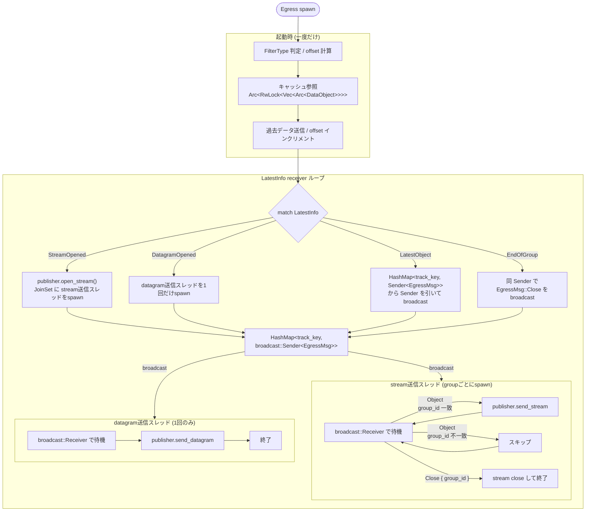

## Egress 設計仕様

### 概要

```
Egress spawn
├── [起動時一度だけ] FilterType → offset計算 → キャッシュ → 過去データ送信
└── [以降] LatestInfo receiver ループ
```

---

### 起動時処理

`FilterType` を見て初期 `offset` を計算し、`Arc<RwLock<Vec<Arc<DataObject>>>>` のキャッシュから該当データを取り出して送信。以降は `offset` をインクリメントで追跡。

---

### LatestInfo イベントごとの挙動

| イベント | 処理 |
|---|---|
| `StreamOpened { track_key, group_id }` | `publisher.open_stream()` → `JoinSet` に stream送信スレッドをspawn |
| `DatagramOpened { track_key, group_id }` | 同様に datagram送信スレッドを1回だけspawn |
| `LatestObject { track_key, group_id, offset }` | `HashMap<track_key, broadcast::Sender<EgressMsg>>` からSenderを引いてbroadcast |
| `EndOfGroup { track_key, group_id }` | 同じSenderで `EgressMsg::Close { group_id }` をbroadcast |

---

### 送信スレッド内の挙動

```rust
enum EgressMsg {
    Object { group_id: u64, offset: u64, data: Bytes },
    Close  { group_id: u64 },
}
```

- **stream送信スレッド**: `broadcast::Receiver` で受け取り、`group_id` が一致するものだけ処理・スキップ。`Close` を受けたら当該streamをcloseして終了。
- **datagram送信スレッド**: 同じく受け取るが、1回処理したらループ終了。

---

### 補足

- `HashMap<track_key, broadcast::Sender<EgressMsg>>` はEgressメインスレッドが所有
- `StreamOpened` は同一 `track_key` に複数回来る（groupごとにstreamが増える）ので、その都度新しいスレッドをspawnしてSenderを差し替えず**追加**する形
- `DatagramOpened` は `track_key` に対して1回のみ

---

### フローチャート

