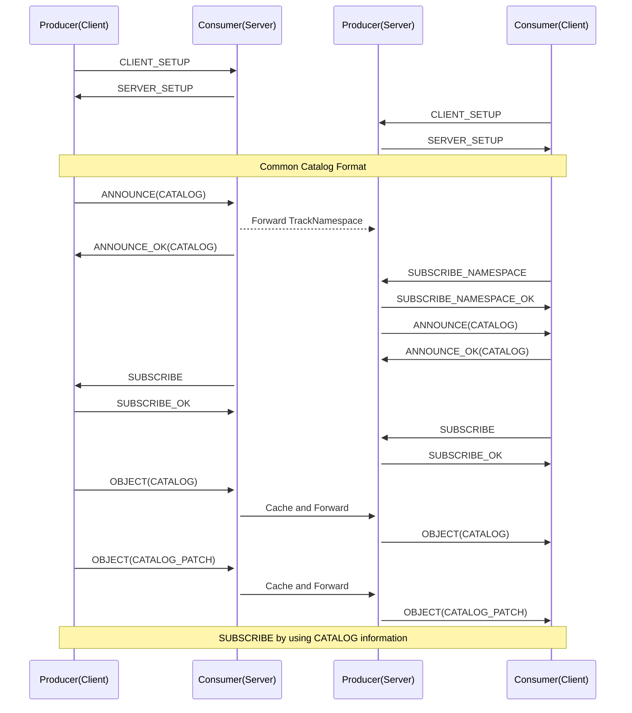

```mermaid
sequenceDiagram
    participant Producer(Client)
    participant Consumer(Server)
    participant Producer(Server)
    participant Consumer(Client)

    Producer(Client) ->> Consumer(Server): CLIENT_SETUP
    activate Consumer(Server)
    Consumer(Server) ->> Producer(Client): SERVER_SETUP
    Consumer(Client) ->> Producer(Server): CLIENT_SETUP
    activate Producer(Server)
    Producer(Server) ->> Consumer(Client): SERVER_SETUP

    Note over Producer(Client), Consumer(Client) : Common Catalog Format
    Producer(Client) ->> Consumer(Server): ANNOUNCE(CATALOG)
    Consumer(Server) -->> Producer(Server): Forward TrackNamespace
    Consumer(Server) ->> Producer(Client): ANNOUNCE_OK(CATALOG)
    Consumer(Client) ->> Producer(Server): SUBSCRIBE_NAMESPACE
    Producer(Server) ->> Consumer(Client): SUBSCRIBE_NAMESPACE_OK
    Producer(Server) ->> Consumer(Client): ANNOUNCE(CATALOG)
    Consumer(Client) ->> Producer(Server): ANNOUNCE_OK(CATALOG)

    Consumer(Server) ->> Producer(Client): SUBSCRIBE
    Producer(Client) ->> Consumer(Server): SUBSCRIBE_OK
    Consumer(Client) ->> Producer(Server): SUBSCRIBE
    Producer(Server) ->> Consumer(Client): SUBSCRIBE_OK

    Producer(Client) ->> Consumer(Server): OBJECT(CATALOG)
    Consumer(Server) ->> Producer(Server): Cache and Forward
    Producer(Server) ->> Consumer(Client): OBJECT(CATALOG)

    Producer(Client) ->> Consumer(Server): OBJECT(CATALOG_PATCH)
    Consumer(Server) ->> Producer(Server): Cache and Forward
    Producer(Server) ->> Consumer(Client): OBJECT(CATALOG_PATCH)

    Note over Producer(Client), Consumer(Client) : SUBSCRIBE by using CATALOG information

```
